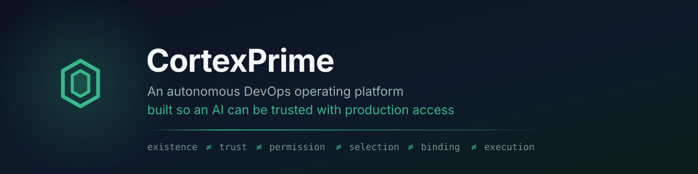

<div align="center">



### Run autonomous AI workforces at enterprise scale

Build, orchestrate, govern, and observe intelligent agents across your organization — from one unified platform.

[](https://github.com/chandu0580/CortexPrime/actions/workflows/architecture.yml)
[](https://github.com/chandu0580/CortexPrime/actions/workflows/ci.yml)
[](https://github.com/chandu0580/CortexPrime/actions/workflows/security.yml)


**Enterprise Security · On-Prem or Cloud · Governance & Guardrails · Replay & Audit Trails**

<br>


</div>

---

## What CortexPrime is

An AI operating system for the enterprise. Specialist agents — research, browser, computer-use, voice, memory — coordinate under shared mission context, and every action they take on a real system passes through a governance layer built to be authorised, audited, and stopped.

The difference is what happens at the moment an agent touches production. Most platforms treat that as a prompt or a wrapper around a shell. CortexPrime treats it as architecture: the unsafe operation is not blocked at runtime, it is **unrepresentable** in the control flow.

---

## Platform

| | |
|---|---|
| 🤖 **Multi-Agent Orchestration** | Coordinate specialist agents with shared mission context |
| 🎙️ **Real-time Voice AI** | Operators can guide, approve, and intervene instantly |
| 🧠 **Memory & Knowledge** | Persistent memory layers keep missions grounded |
| 🛡️ **Governance & Guardrails** | Policy-aware execution for regulated environments |
| 📊 **Observability & Monitoring** | Live insight into autonomy, cost, and runtime health |
| ⏮️ **Replay & Audit Trails** | Trace every decision, event, and tool invocation |
| 🔐 **Secure by Design** | Identity, access, and isolation built into the runtime |
| 🏢 **Enterprise Ready** | Deploy into internal networks, cloud, or hybrid stacks |

The operator console covers Overview, Runtime, Agents, Missions, Voice, Memory, Research, Computer Use, Browser Agent, Governance, Replay, Analytics, Monitoring, Integrations and Settings.

---

## How governance works

Every action an agent proposes travels one path. There is no second route to a production system.

```
  API   ·   Agent   ·   Scheduler   ·   ChatOps
                      │
                      ▼
┌─────────────────────────────────────────────────────────────┐
│  CAPABILITY FABRIC              what may happen              │
│                                                              │
│  Identity → Tenant → Authorization → Policy/Risk →           │
│  Approval/Autonomy → Action digest → Binding                 │
└──────────────────────────────┬──────────────────────────────┘
                               │  immutable, expiring binding
┌──────────────────────────────▼──────────────────────────────┐
│  DURABLE EXECUTION             what did happen               │
│                                                              │
│  Revision-checked claim · Leases · Attempts · Recovery ·     │
│  Replay · Hash-chained audit                                 │
└──────────────────────────────┬──────────────────────────────┘
                               │  one governed path, no bypass
┌──────────────────────────────▼──────────────────────────────┐
│  CONTAINED WORKERS             who may touch the world       │
│                                                              │
│  Own container · non-root · read-only rootfs · no standing   │
│  credential · compiled bindings · egress allow-list          │
└──────────────────────────────┬──────────────────────────────┘
                               ▼
                    Kubernetes   ·   GitHub
                               │
                               ▼
                    INDEPENDENT VERIFICATION
```

A model may **propose**. It never decides. Authorization and provider selection are deterministic and inspectable, and the outcome of any change is established by re-reading the world through a separate path — never by trusting the worker's own reply.

---

## Why enterprises can trust it

Six separations, enforced in code rather than convention:

```
existence  ≠  trust  ≠  permission  ≠  selection  ≠  binding  ≠  execution
```

A capability existing in the registry does not mean it is trusted. Trusted does not mean a given user may use it. Permission does not decide *which* implementation runs. And a binding made 30 seconds ago is re-verified before anything touches a real system.

| Guarantee | What it prevents |
|---|---|
| **"Unknown" is a first-class outcome** | A lost response means nobody knows whether the change landed. Calling that "failed" and retrying is how a delete runs twice. |
| **No silent retry** | Every retry is a recorded decision with a reason. An operation that must not repeat is refused even when the error looks retryable. |
| **Separation of duties** | Whoever registers a capability cannot enable it. Whoever requests an action cannot approve it. |
| **Replay cannot execute** | The replay engine holds no repository, no worker pool, no queue. Re-running history is structurally impossible. |
| **Outcomes are verified independently** | A worker reporting success is not success. |
| **Fails closed everywhere** | Policy unreachable → deny. Worker unresolvable → refuse. No default worker, no default tenant, no fallback provider. |

> **Exactly-once is never claimed.** Nothing crossing a network can honestly promise it. CortexPrime provides durable at-least-once dispatch with a revision-checked claim, idempotency where the provider supports it, and independent verification.

---

## Security

| Control | Implementation |
|---|---|
| **Authentication** | JWT, verified before any tenant resolution |
| **Tenant isolation** | Enforced in SQL by a storage guard — another tenant's record cannot be returned even when its id is known exactly |
| **Authorization** | Deterministic policy, default deny, no model in the path |
| **Approval** | Bound to an action digest, consumed once, replay refused |
| **Credentials** | Vault-issued per action; never in environment, logs, metrics, queue payloads or execution records |
| **Execution isolation** | Contained workers: own container, non-root, read-only root filesystem, no automounted token, digest-pinned, egress allow-list |
| **Audit** | Hash-chained with a fenced single writer; refusals recorded as deliberately as successes |
| **Untrusted content** | Repository and provider content is evidence, never instruction — it cannot name a capability or supply an argument |

---

## Quickstart

**Run the platform**

```bash
python -m venv venv && source venv/bin/activate   # Windows: venv\Scripts\activate
pip install -r requirements.txt
cp .env.example backend/.env                      # add your API keys
uvicorn backend.main:app --reload --port 8000

cd frontend && npm install && npm run dev         # http://localhost:3000
```

**Deploy the governed plane** — requires Kubernetes, PostgreSQL and Vault.

```bash
helm upgrade --install cortexprime ./helm/cortexprime-governed -n cortexprime \
  --set connection.tenant=<tenant> \
  --set connection.namespace=<namespace> \
  --set database.existingSecret=<secret> \
  --wait
```

**See one governed change, end to end**

```bash
python scripts/demo_governed_write.py --slow
```

An anonymous caller is refused · connector health is read as the tenant · a change requiring human approval is requested · a member without approve authority is refused · the scoped approver grants it · a contained worker performs it · and **Kubernetes itself** confirms the result.

---

## Integrations

| Connector | Capabilities |
|---|---|
| **Kubernetes** | Workload, pod, event and deployment reads · governed rollout restart · governed rollback |
| **GitHub** | Repository, commit, pull request, workflow and deployment reads · governed issue comment |

Connectors are manifest-driven: one declaration produces the adapters, the capability contracts, the connection scope, the credential source and the health probe. Adding one does not add a governance path.

---

## Stack

| Layer | Technology |
|---|---|
| **Backend** | Python 3.11 · FastAPI · domain-driven design with strict bounded contexts |
| **Frontend** | Next.js 16 · TypeScript · Zustand · live WebSocket event streaming |
| **AI** | OpenAI-compatible · Anthropic · Gemini · Ollama — provider-routed |
| **Data** | PostgreSQL · Redis · ChromaDB · Neo4j |
| **Infrastructure** | Docker · Kubernetes (Helm) · HashiCorp Vault · GitHub Actions |

<sub>~1,200 backend modules · ~1,800 frontend modules · 311 test files · 118 architecture decision records · 43 CI-enforced architecture rules</sub>

---

## Documentation

| | |
|---|---|
| [`docs/adr/`](docs/adr/) | 118 architecture decision records — each states the decision, the failure mode it prevents, its cost, and what it explicitly does not claim |
| [`docs/KUBERNETES_CONNECTOR_RUNBOOK.md`](docs/KUBERNETES_CONNECTOR_RUNBOOK.md) | Connect a cluster, read health, run a governed change |
| [`docs/GITHUB_CONNECTOR_RUNBOOK.md`](docs/GITHUB_CONNECTOR_RUNBOOK.md) | Connect repositories and post a governed comment |
| [`docs/CONNECTOR_ARCHITECTURE.md`](docs/CONNECTOR_ARCHITECTURE.md) | How to add the next connector |
| [`docs/PHASE_*.md`](docs/) | Engineering verification reports — marked FACT / INFERENCE / UNKNOWN, including current limitations |

Start with [ADR-031](docs/adr/ADR-031-durable-execution-core.md) (why "unknown" is a first-class outcome) and [ADR-125](docs/adr/ADR-125-phase-11-1-kubernetes-reference-connector.md) (what a production connector requires).

---

<div align="center">
<sub>© CortexPrime. Private and proprietary. All rights reserved.<br>
This repository and its contents are confidential and may not be copied, distributed, or disclosed without written permission.</sub>
</div>
