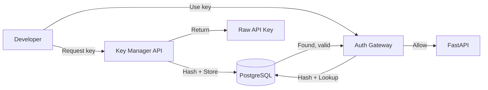

# CortexPrime Architecture Guide

**Version:** 1.0.0 GA  
**Last Updated:** 2026-07-04  
**Classification:** Internal — Engineering Team

---

## Table of Contents

1. [System Overview](#1-system-overview)
2. [Frontend Architecture](#2-frontend-architecture)
3. [Backend Architecture](#3-backend-architecture)
4. [Database Layer](#4-database-layer)
5. [Event Bus Architecture](#5-event-bus-architecture)
6. [Mission Runtime](#6-mission-runtime)
7. [Memory System](#7-memory-system)
8. [Knowledge Graph](#8-knowledge-graph)
9. [Worker Architecture](#9-worker-architecture)
10. [Connector Framework](#10-connector-framework)
11. [Enterprise Modules](#11-enterprise-modules)
12. [Security Architecture](#12-security-architecture)
13. [Deployment Architecture](#13-deployment-architecture)
14. [Data Flow Diagrams](#14-data-flow-diagrams)

---

## 1. System Overview

### High-Level Architecture

```
┌─────────────────────────────────────────────────────────────────────────────┐
│                            CLIENT TIER                                       │
│  ┌──────────┐  ┌──────────┐  ┌──────────┐  ┌──────────────┐               │
│  │ Web UI   │  │ Desktop  │  │ Mobile   │  │ 3rd-Party    │               │
│  │ (Next.js)│  │ (Tauri)  │  │ (React)  │  │ API Clients  │               │
│  └────┬─────┘  └────┬─────┘  └────┬─────┘  └──────┬───────┘               │
│       │              │              │               │                       │
│       └──────────────┴──────────────┴───────────────┘                       │
│                              │  HTTPS/WSS                                   │
└──────────────────────────────┼──────────────────────────────────────────────┘
                               │
┌──────────────────────────────┼──────────────────────────────────────────────┐
│                         GATEWAY TIER                                        │
│              ┌─────────────────────────────────┐                           │
│              │         Nginx / HAProxy          │                           │
│              │  TLS Termination · Rate Limiting │                           │
│              │  Load Balancing · WAF            │                           │
│              └────────────────┬────────────────┘                           │
│                               │                                             │
│              ┌─────────────────────────────────┐                           │
│              │    Authentication Proxy         │                           │
│              │  JWT Validation · OAuth2 Proxy  │                           │
│              └────────────────┬────────────────┘                           │
└──────────────────────────────┼──────────────────────────────────────────────┘
                               │
┌──────────────────────────────┼──────────────────────────────────────────────┐
│                       APPLICATION TIER                                      │
│                                                                             │
│  ┌──────────────────────────────────────────────────────────────────────┐  │
│  │                     FastAPI Application                               │  │
│  │  ┌──────────┐ ┌──────────┐ ┌──────────┐ ┌──────────┐ ┌──────────┐  │  │
│  │  │ Mission  │ │ Memory   │ │ Knowledge│ │ Connector│ │ Enterprise│  │  │
│  │  │ Runtime  │ │ System   │ │ Graph    │ │ Framework│ │ Modules   │  │  │
│  │  └──────────┘ └──────────┘ └──────────┘ └──────────┘ └──────────┘  │  │
│  │  ┌──────────┐ ┌──────────┐ ┌──────────┐ ┌──────────┐              │  │
│  │  │ Event Bus│ │ Agent    │ │ LLM      │ │ Safety   │              │  │
│  │  │          │ │ Orchestr.│ │ Gateway  │ │ Guardrails             │  │
│  │  └──────────┘ └──────────┘ └──────────┘ └──────────┘              │  │
│  └──────────────────────────────────────────────────────────────────────┘  │
│                                    │                                        │
└────────────────────────────────────┼────────────────────────────────────────┘
                                     │
┌────────────────────────────────────┼────────────────────────────────────────┐
│                            DATA TIER                                        │
│                                                                             │
│  ┌──────────────┐  ┌──────────────┐  ┌──────────────┐                     │
│  │  PostgreSQL   │  │    Redis     │  │    Neo4j     │                     │
│  │  (pgvector)   │  │  (Cache/Queue)│  │  (Graph DB)  │                     │
│  │  · Missions   │  │  · Sessions  │  │  · Entities  │                     │
│  │  · Users      │  │  · Rate Lim. │  │  · Relations │                     │
│  │  · Events     │  │  · Pub/Sub   │  │  · Embeddings│                     │
│  │  · Vectors    │  │  · Job Queue │  │  · Traversal │                     │
│  └──────────────┘  └──────────────┘  └──────────────┘                     │
│                                                                             │
└─────────────────────────────────────────────────────────────────────────────┘
```

### Component Relationships

| Component | Depends On | Provides |
|---|---|---|
| Mission Runtime | Event Bus, LLM Gateway, Memory System, Knowledge Graph | Mission lifecycle management |
| Memory System | PostgreSQL (pgvector), Embedding Service | 4-tier memory storage & retrieval |
| Knowledge Graph | Neo4j, Inference Engine | Entity relationship management |
| Event Bus | Redis, WebSocket Manager | Pub/sub event distribution |
| Connector Framework | Event Bus, Worker Pool | External system integration |
| Worker Pool | Browser/Desktop/VM Runtimes | Sandboxed task execution |

### Data Flow Summary

```
User Request → Auth Gateway → FastAPI Router → Mission Runtime → Event Bus
  → Agent Orchestrator → LLM Gateway → Memory/Knowledge Lookup
  → Action Execution (Worker/Connector) → Result Aggregation
  → Memory Update → Response → WebSocket Stream → Client
```

---

## 2. Frontend Architecture

### Technology Stack

| Layer | Technology | Version |
|---|---|---|
| Framework | Next.js | 16 (App Router) |
| UI Library | React | 19 |
| State Management | Zustand | 5.x |
| Styling | Tailwind CSS + Radix UI | Latest |
| Forms | React Hook Form + Zod | Latest |
| Real-Time | WebSocket (useSocket hook) | — |
| Charts | Recharts / D3.js | Latest |

### App Router Structure

```
app/
├── (auth)/                    # Auth route group
│   ├── login/
│   ├── signup/
│   ├── oauth/[provider]/
│   └── reset-password/
├── (dashboard)/               # Main app route group
│   ├── dashboard/
│   ├── missions/
│   │   ├── [id]/
│   │   │   ├── page.tsx      # Mission detail
│   │   │   ├── timeline/     # Timeline view
│   │   │   └── artifacts/    # Output artifacts
│   │   └── new/
│   ├── memory/
│   │   ├── explorer/         # Memory browser
│   │   └── search/
│   ├── knowledge/
│   │   ├── graph/            # Knowledge graph viewer
│   │   └── entities/
│   ├── connectors/
│   │   ├── [type]/
│   │   └── settings/
│   ├── settings/
│   ├── admin/                # Enterprise admin
│   │   ├── users/
│   │   ├── audit-log/
│   │   └── approvals/
│   └── developer/            # Developer portal
│       ├── playground/
│       └── api-keys/
├── api/                      # API route handlers
│   └── [...rest]/route.ts    # BFF proxy to backend
├── layout.tsx                # Root layout
└── providers.tsx             # Client providers
```

### Component Hierarchy

```
<RootLayout>
  <Providers>            — ThemeProvider, AuthProvider, SocketProvider
    <AppShell>
      <Sidebar>          — Navigation, workspace selector
      <TopBar>           — Search, notifications, user menu
      <MainContent>
        <PageLayout>
          <Breadcrumbs />
          <PageHeader /> — Title, actions, status badges
          <PageContent />— Route-specific content
        </PageLayout>
      </MainContent>
      <PanelSystem>      — Resizable panels (inspector, logs, etc.)
    </AppShell>
    <ModalLayer />
    <ToastContainer />
  </Providers>
</RootLayout>
```

### Zustand Stores

| Store | Purpose | Persistence |
|---|---|---|
| `useAuthStore` | Auth state, tokens, user profile | localStorage |
| `useMissionStore` | Active mission, execution state, timeline | sessionStorage |
| `useMemoryStore` | Memory search results, filters | None |
| `useKnowledgeStore` | Graph state, selected entities | None |
| `useConnectorStore` | Connector registry, status, metrics | None |
| `useUIStore` | Panel layout, theme, sidebar state | localStorage |
| `useNotificationStore` | Toast queue, badge counts | None |
| `useSettingsStore` | User preferences, API configuration | localStorage |

### Data Flow: Frontend to Backend

```
React Component
  → Zustand Action
    → API Client (fetch/axios)
      → Next.js API Route (BFF)
        → FastAPI Backend
          → Response
      → Zustand Store Update
    → React Re-render
```

Real-time updates flow via WebSocket:

```
WebSocket Message → Socket Client → Zustand Store → React Re-render
```

---

## 3. Backend Architecture

### FastAPI Application Structure

```
app/
├── main.py                    # Application entry, lifespan events
├── config.py                  # Settings via pydantic-settings
├── dependencies.py            # FastAPI dependency injection
├── api/
│   ├── v1/
│   │   ├── router.py          # Versioned router aggregation
│   │   ├── missions.py        # Mission CRUD + execution
│   │   ├── memory.py          # Memory endpoints
│   │   ├── knowledge.py       # Knowledge graph endpoints
│   │   ├── connectors.py      # Connector management
│   │   ├── auth.py            # Authentication endpoints
│   │   ├── admin.py           # Admin endpoints
│   │   └── websocket.py       # WebSocket endpoint
│   └── deps/                  # Route-level dependencies
├── core/
│   ├── auth/                  # AuthN/AuthZ subsystem
│   │   ├── jwt.py
│   │   ├── oauth2.py
│   │   ├── rbac.py
│   │   └── abac.py
│   ├── event_bus/             # Event bus subsystem
│   ├── mission/               # Mission runtime
│   ├── memory/                # Memory system
│   ├── knowledge/             # Knowledge graph
│   ├── connectors/            # Connector framework
│   ├── workers/               # Worker pool management
│   ├── llm/                   # LLM gateway
│   ├── safety/                # Safety guardrails
│   ├── enterprise/            # Enterprise modules
│   └── security/              # Audit, secrets, encryption
├── models/                    # SQLAlchemy ORM models
├── schemas/                   # Pydantic request/response schemas
├── services/                  # Business logic services
├── tasks/                     # Background task definitions
└── utils/                     # Shared utilities
```

### Middleware Stack

```
Request → [CORSMiddleware] → [TrustedHostMiddleware]
  → [RequestIDMiddleware] → [AuthMiddleware]
    → [AuditLogMiddleware] → [RateLimitMiddleware]
      → [SessionMiddleware] → Route Handler
```

| Middleware | Order | Purpose |
|---|---|---|
| CORSMiddleware | 1 | CORS header enforcement |
| TrustedHostMiddleware | 2 | Host header validation |
| RequestIDMiddleware | 3 | Request tracing (X-Request-ID) |
| AuthMiddleware | 4 | JWT/OAuth2/API Key validation |
| AuditLogMiddleware | 5 | Request/response audit capture |
| RateLimitMiddleware | 6 | Token bucket rate limiting |
| SessionMiddleware | 7 | User session hydration |

### Dependency Injection

FastAPI's `Depends()` is used for all dependency resolution:

```python
# Typical endpoint signature
@router.post("/missions")
async def create_mission(
    payload: MissionCreate,
    user: User = Depends(get_current_user),
    db: AsyncSession = Depends(get_db_session),
    bus: EventBus = Depends(get_event_bus),
    rate_limiter: RateLimiter = Depends(get_rate_limiter),
    audit: AuditService = Depends(get_audit_service),
) -> MissionResponse:
```

Key dependency providers are registered in `app/dependencies.py`:

| Provider | Scope | Lifecycle |
|---|---|---|
| `get_db_session` | Request | Async session per request |
| `get_redis_client` | Singleton | Connection pool |
| `get_neo4j_driver` | Singleton | Driver instance |
| `get_event_bus` | Singleton | Channel-based bus |
| `get_current_user` | Request | JWT → user hydration |
| `get_rate_limiter` | Singleton | Token bucket |
| `get_audit_service` | Singleton | Async audit writer |

### Async Execution Model

All I/O-bound operations use `asyncio` with structured concurrency:

```python
async def execute_mission(mission_id: UUID) -> None:
    async with TaskGroup() as tg:
        # Parallel phases
        research_task = tg.create_task(research_phase(mission_id))
        resource_task = tg.create_task(load_resources(mission_id))

    # Sequential phases
    reasoning = await reasoning_phase(mission_id, research_task.result())
    validation = await validation_phase(mission_id, reasoning)

    # Fan-out writes
    async with TaskGroup() as tg:
        tg.create_task(update_memory(mission_id, reasoning))
        tg.create_task(update_graph(mission_id, reasoning))
        tg.create_task(emit_completion_event(mission_id))
```

CPU-bound operations (embedding, encryption) are offloaded to a thread pool:

```python
loop = asyncio.get_running_loop()
embedding = await loop.run_in_executor(thread_pool, generate_embedding, text)
```

---

## 4. Database Layer

### PostgreSQL (pgvector)

**Purpose:** Primary operational store, vector embeddings, mission history, user data.

**Connection Management:**

```python
# app/core/database.py
from sqlalchemy.ext.asyncio import create_async_engine, async_sessionmaker

engine = create_async_engine(
    settings.DATABASE_URL,
    pool_size=20,
    max_overflow=10,
    pool_pre_ping=True,
    pool_recycle=3600,
    echo=False,
)

AsyncSessionLocal = async_sessionmaker(engine, expire_on_commit=False)
```

**Key Tables:**

| Table | Purpose | Key Columns | Indices |
|---|---|---|---|
| `users` | User accounts | id, email, password_hash, role_id | email (unique), org_id |
| `missions` | Mission executions | id, status, user_id, config, created_at | user_id, status, created_at |
| `mission_steps` | Individual step traces | id, mission_id, stage, input, output, tokens | mission_id, stage |
| `memory_entries` | All memory tiers | id, tier, content, embedding, metadata | tier, user_id, embedding (ivfflat) |
| `events` | All system events | id, type, source, payload, timestamp | type, source, timestamp |
| `connector_instances` | Connector configs | id, type, config, status, user_id | user_id, type |
| `audit_log` | Security audit trail | id, user_id, action, resource, ip, timestamp | user_id, action, timestamp |
| `api_keys` | API key hashes | id, key_hash, user_id, permissions, expires_at | key_hash, user_id |
| `approvals` | Approval workflow | id, requestor, resource, level, status, expires_at | status, level |

**pgvector Usage:**

```sql
CREATE INDEX idx_memory_embedding ON memory_entries
  USING ivfflat (embedding vector_cosine_ops)
  WITH (lists = 100);

-- Similarity search
SELECT content, 1 - (embedding <=> :query_embedding) AS similarity
FROM memory_entries
WHERE tier = :tier
  AND user_id = :user_id
ORDER BY embedding <=> :query_embedding
LIMIT :limit;
```

### Redis

**Purpose:** Caching, session storage, rate limiting, pub/sub event bus, job queue.

**Connection Management:**

```python
# app/core/redis.py
import redis.asyncio as aioredis

redis_client = aioredis.from_url(
    settings.REDIS_URL,
    encoding="utf-8",
    decode_responses=True,
    socket_connect_timeout=5,
    socket_keepalive=True,
    max_connections=50,
)
```

**Key Namespaces:**

| Key Pattern | Purpose | TTL |
|---|---|---|
| `session:{user_id}` | User session data | 24h |
| `ratelimit:{user_id}:{endpoint}` | Token bucket state | 1h |
| `cache:{key}` | Response cache | 5m–1h |
| `ws:{user_id}` | WebSocket connection map | — |
| `job:{job_id}` | Async job status | 7d |
| `event:channel:{channel}` | Event stream buffer | 1h |
| `lock:{resource}` | Distributed lock | 30s |

### Neo4j

**Purpose:** Knowledge graph storage, entity relationship management, graph traversal for inference.

**Connection Management:**

```python
# app/core/neo4j.py
from neo4j import AsyncGraphDatabase

neo4j_driver = AsyncGraphDatabase.driver(
    settings.NEO4J_URI,
    auth=(settings.NEO4J_USER, settings.NEO4J_PASSWORD),
    max_connection_lifetime=3600,
    max_connection_pool_size=50,
)
```

**Graph Model (see Section 8 for full details):**

```
(:Entity {type, name, embedding, metadata})
  -[:RELATES_TO {type, weight, source, confidence}]-> (:Entity)
  -[:BELONGS_TO]-> (:Category {name, description})
  -[:HAS_PROPERTY]-> (:Property {key, value})
```

### Database Transaction Boundaries

```
┌─────────────────────────────────────────────────────────┐
│                    Request Lifecycle                      │
│                                                           │
│  Begin AsyncSession ─────────────────────────────────┐   │
│    │ PostgreSQL writes (mission, events, audit)      │   │
│    │ Neo4j writes (knowledge graph updates)          │   │
│    │ Redis writes (cache invalidation, pub)          │   │
│    ├── COMMIT all on success                          │   │
│    └── ROLLBACK PostgreSQL + manual Neo4j rollback    │   │
│                                                       │   │
│  Note: Distributed transactions use Saga pattern       │   │
│  with compensating actions for rollback.              │   │
└─────────────────────────────────────────────────────────┘
```

---

## 5. Event Bus Architecture

### Overview

The event bus is a channel-based publish/subscribe system built on Redis pub/sub with in-memory routing for local subscribers. It handles all inter-component communication with 35+ defined event categories.

### Architecture Diagram

```
┌──────────────────────────────────────────────────────────┐
│                    EVENT BUS                               │
│                                                           │
│  Publisher ──→ EventBus.emit(event)                       │
│                    │                                       │
│                    ├──→ [Channel Router]                   │
│                    │       │                                │
│                    │       ├──→ Redis Pub/Sub ──→ Remote   │
│                    │       │                    Subscribers │
│                    │       │                                │
│                    │       └──→ In-Memory Bus ──→ Local    │
│                    │                              Subscribers │
│                    │                                        │
│                    └──→ [Event Store] ──→ PostgreSQL        │
│                                        (persistence)       │
└──────────────────────────────────────────────────────────┘
```

### Event Categories

| Category | Events | Source |
|---|---|---|
| `auth.*` | login, logout, token_refresh, mfa_challenge, password_change | Auth Service |
| `mission.*` | created, started, paused, resumed, cancelled, completed, failed | Mission Runtime |
| `mission.step.*` | step_started, step_completed, step_failed, tool_call | Agent Orchestrator |
| `memory.*` | stored, retrieved, consolidated, deleted, tier_promoted | Memory System |
| `knowledge.*` | entity_created, relationship_added, graph_merged, inference_triggered | Knowledge Graph |
| `connector.*` | registered, connected, disconnected, error, throttle, rate_limited | Connector Framework |
| `worker.*` | spawned, task_assigned, task_completed, task_failed, heartbeat, died | Worker Pool |
| `llm.*` | request_sent, response_received, token_usage, rate_limited, fallback | LLM Gateway |
| `safety.*` | content_blocked, url_blocked, malicious_input_detected, threshold_breached | Safety Guardrails |
| `approval.*` | requested, escalated, delegated, approved, rejected, expired, break_glass | Approval Service |
| `admin.*` | user_created, role_changed, config_updated, system_announcement | Admin Service |
| `audit.*` | event_captured, retention_applied, export_requested | Audit Service |
| `system.*` | startup, shutdown, health_check_failed, config_reload, maintenance | Core System |
| `enterprise.*` | license_updated, usage_report, quota_warning | Enterprise Modules |

### Event Schema

```python
@dataclass
class Event:
    id: UUID                    # Unique event identifier
    type: str                   # Dot-notation type (e.g., "mission.step.completed")
    source: str                 # Component identifier
    timestamp: datetime         # UTC timestamp
    payload: dict               # Event-specific data
    metadata: EventMetadata     # Correlation, tenant, tracing context
    priority: EventPriority     # LOW, NORMAL, HIGH, CRITICAL
    ttl: int | None             # Time-to-live in seconds (None = persistent)

@dataclass
class EventMetadata:
    correlation_id: UUID        # Links related events
    tenant_id: str              # Multi-tenant isolation
    user_id: UUID | None        # Originating user
    trace_id: str               # Distributed tracing
    span_id: str                # Current span
```

### Subscription and Routing

```python
# Subscription API
event_bus.subscribe("mission.*", handler_fn, group="mission-service")
event_bus.subscribe(["mission.completed", "mission.failed"], notification_handler)
event_bus.subscribe("llm.token_usage", metrics_handler, filter=TokenFilter(min_tokens=1000))

# Routing logic
class ChannelRouter:
    def route(self, event: Event) -> list[str]:
        channels = [event.type]
        # Wildcard expansion
        parts = event.type.split(".")
        for i in range(len(parts)):
            channels.append(".".join(parts[:i]) + ".*")
        # Category-level
        channels.append(parts[0] + ".*")
        return channels
```

### WebSocket Streaming

WebSocket connections subscribe to user-specific and global channels:

```
Client connects → /ws/v1?token={jwt}
  → AuthMiddleware validates token
  → WebSocketManager registers connection
  → Event Bus subscribes user channels:
      - user:{user_id}:*        (user-specific events)
      - mission:{mission_id}:*  (mission-specific events)
      - notification:*          (global notifications)
  → Events flow: Event Bus → Channel Match → WebSocketManager → WS Send
```

### Filtering and Backpressure

| Feature | Implementation |
|---|---|
| Content filtering | Predicate-based filters on subscriber registration |
| Rate-limited subscribers | Token bucket per subscriber channel |
| Backpressure | Sliding window with drop policy (oldest events first) |
| Dead letter queue | Events that exceed retry count → `event:dlq:{type}` |
| Event buffering | Redis stream with consumer groups for durable subscribers |

---

## 6. Mission Runtime

### Execution Pipeline

Missions progress through a state machine with 8 stages:

```
                    ┌──────────────┐
                    │     INIT     │
                    └──────┬───────┘
                           │
                    ┌──────▼───────┐
                    │   PLANNING   │
                    └──────┬───────┘
                           │
                    ┌──────▼───────┐
                    │ RESEARCHING  │◄──────────────┐
                    └──────┬───────┘               │
                           │                       │
                    ┌──────▼───────┐               │
                    │   REASONING  │               │
                    └──────┬───────┘               │
                           │                       │
                    ┌──────▼───────┐               │
                    │  VALIDATING  │───retry───────┘
                    └──────┬───────┘
                           │ fail
                    ┌──────▼───────┐
                    │  GENERATING  │
                    └──────┬───────┘
                           │
                    ┌──────▼──────────┐
                    │ MEMORY_UPDATE   │
                    └──────┬──────────┘
                           │
                    ┌──────▼──────┐
                    │  COMPLETED  │
                    └─────────────┘
```

### Stage Detail

| Stage | Description | LLM Usage | Duration |
|---|---|---|---|
| **INIT** | Validate inputs, load context, resolve references | None | < 1s |
| **PLANNING** | Generate execution plan, decompose into sub-tasks | 1 LLM call | 2–10s |
| **RESEARCHING** | Gather information via memory, knowledge graph, web | 0–5 LLM calls | 10–120s |
| **REASONING** | Analyze gathered data, draw conclusions | 1–3 LLM calls | 5–30s |
| **VALIDATING** | Verify reasoning against constraints, retry on failure | 1 LLM call | 2–10s |
| **GENERATING** | Produce final output (text, code, artifacts) | 1–5 LLM calls | 5–60s |
| **MEMORY_UPDATE** | Consolidate experience into memory system | Embedded | 1–5s |
| **COMPLETED** | Finalize, emit events, notify subscribers | None | < 1s |

### Agent Orchestration

```
Mission Runtime
  │
  ├── Orchestrator ── Agent Loop
  │     │
  │     ├── Planner Agent      — Decompose mission into steps
  │     ├── Researcher Agent   — Information gathering
  │     ├── Reasoner Agent     — Analysis and inference
  │     ├── Validator Agent    — Constraint checking
  │     └── Generator Agent    — Output production
  │
  ├── Tool Registry
  │     ├── MemoryTool         — Read/write memory
  │     ├── KnowledgeTool      — Query knowledge graph
  │     ├── WebSearchTool      — Web research
  │     ├── CodeExecTool       — Sandboxed code execution
  │     ├── ConnectorTool      — External system access
  │     └── FileTool           — File read/write operations
  │
  └── LLM Gateway
        ├── Provider Router    — Model selection logic
        ├── Rate Limiter       — Token/request rate limiting
        ├── Fallback Handler   — Provider failover
        └── Token Tracker      — Usage accounting
```

### Agent Loop (Pseudocode)

```python
async def agent_loop(mission: Mission) -> MissionResult:
    context = await load_context(mission)
    plan = await planner_agent.generate_plan(mission.objective, context)

    for step in plan.steps:
        research = await researcher_agent.gather(step, context)
        reasoning = await reasoner_agent.analyze(step, research, context)
        validated = await validator_agent.validate(reasoning, step.constraints)

        if not validated.passed and validated.retry_count < MAX_RETRIES:
            step.context["feedback"] = validated.feedback
            return await agent_loop(mission)  # Retry with feedback

        context[step.id] = reasoning

    output = await generator_agent.produce(mission, context)
    await memory_system.consolidate(mission.id, context, output)
    return MissionResult(output=output, trace=context)
```

### LLM Gateway

```python
class LLMGateway:
    def __init__(self):
        self.providers = {
            "openai": OpenAIProvider(),
            "anthropic": AnthropicProvider(),
            "google": GoogleProvider(),
            "local": OllamaProvider(),
        }
        self.router = ModelRouter(strategy="cost_aware")
        self.rate_limiter = TokenBucketRateLimiter()
        self.tracker = TokenUsageTracker()

    async def complete(
        self,
        request: LLMRequest,
        user: User,
    ) -> LLMResponse:
        provider_name = self.router.select(request, user)
        provider = self.providers[provider_name]

        await self.rate_limiter.check(user, request.estimated_tokens)

        try:
            response = await provider.complete(request)
            self.tracker.record(user, provider_name, request, response)
            return response
        except RateLimitError:
            return await self.fallback(request, user, exclude={provider_name})
```

---

## 7. Memory System

### 4-Tier Architecture

```
┌─────────────────────────────────────────────────────────┐
│               REFLECTION MEMORY (Tier 4)                 │
│  High-level abstractions, behavioral patterns,           │
│  user preferences, meta-learning                         │
│  Store: PostgreSQL (pgvector) + periodic summarization   │
├─────────────────────────────────────────────────────────┤
│               SEMANTIC MEMORY (Tier 3)                   │
│  Factual knowledge, concepts, relationships              │
│  Store: PostgreSQL (pgvector) + Neo4j (graph)           │
│  Consolidation: Deduplication, abstraction, linking      │
├─────────────────────────────────────────────────────────┤
│               EPISODIC MEMORY (Tier 2)                   │
│  Specific experiences, mission traces, interactions      │
│  Store: PostgreSQL (pgvector) + event store              │
│  Consolidation: Extraction → abstraction → promotion     │
├─────────────────────────────────────────────────────────┤
│               WORKING MEMORY (Tier 1)                    │
│  Current mission context, active state, recent tokens    │
│  Store: Redis (transient, TTL-based)                     │
│  Eviction: LRU when capacity exceeded                    │
└─────────────────────────────────────────────────────────┘
```

### Retrieval Engine

```python
class RetrievalEngine:
    def __init__(self):
        self.strategies = {
            "semantic": SemanticSearch(),
            "graph": GraphTraversal(),
            "temporal": TemporalRetrieval(),
            "hybrid": HybridRetrieval(),
        }

    async def retrieve(
        self,
        query: str,
        context: RetrievalContext,
    ) -> list[MemoryResult]:
        results = []

        # Step 1: Embedding-based semantic search (all tiers)
        query_embedding = await self.embed(query)
        semantic_results = await self.vector_search(
            query_embedding,
            tiers=context.target_tiers,
            limit=context.semantic_limit,
        )
        results.extend(semantic_results)

        # Step 2: Graph traversal for relational context
        if context.use_graph:
            entities = extract_entities(query)
            graph_results = await self.graph_search(
                entities,
                depth=context.graph_depth,
                limit=context.graph_limit,
            )
            results.extend(graph_results)

        # Step 3: Temporal retrieval for recent context
        if context.use_temporal:
            temporal_results = await self.temporal_search(
                query,
                timeframe=context.timeframe,
                limit=context.temporal_limit,
            )
            results.extend(temporal_results)

        # Step 4: Rerank and deduplicate
        return await self.reranker.rerank(
            results,
            query=query,
            query_embedding=query_embedding,
        )
```

### Embedding Pipeline

```
Text Input
  │
  ├── [Preprocessor]
  │     ├── Chunking (sliding window, overlap=100)
  │     ├── Normalization (lowercase, unicode NFC)
  │     └── Entity extraction (for graph linking)
  │
  ├── [Embedding Model]
  │     ├── Primary: text-embedding-3-large (1536d)
  │     ├── Secondary: intfloat/e5-mistral-7b-instruct (4096d)
  │     └── Fallback: BAAI/bge-small-en-v1.5 (384d)
  │
  └── [Postprocessor]
        ├── Dimension reduction (if needed)
        ├── Normalization (L2)
        └── Index update (ivfflat refresh)
```

### Consolidation Pipeline

```python
async def consolidation_pipeline(user_id: UUID) -> None:
    # Scheduled every N missions or every 24h
    async with TaskGroup() as tg:
        # Tier 2 → Tier 3: Extract facts from episodic memories
        tg.create_task(promote_to_semantic(user_id))
        # Tier 3 → Tier 4: Abstract patterns from semantic memories
        tg.create_task(promote_to_reflection(user_id))
        # Deduplication across tiers
        tg.create_task(deduplicate_embeddings(user_id))
        # Prune low-value entries (score < threshold, age > retention)
        tg.create_task(prune_stale_entries(user_id))
```

### Memory Retrieval Scoring

```
Score = w1 * semantic_similarity
      + w2 * recency_factor
      + w3 * importance_factor
      + w4 * source_reliability
      - w5 * staleness_penalty

Default weights: [0.4, 0.2, 0.2, 0.15, 0.05]
```

---

## 8. Knowledge Graph

### Graph Model

```
Nodes:
  ┌─────────────────────┐
  │     Entity          │ (Base node type)
  │  ├─ id: UUID        │
  │  ├─ type: str       │ [concept, person, organization, document, tool, api,
  │  ├─ name: str       │  event, location, code_package, data_source, metric]
  │  ├─ embedding: vec  │
  │  ├─ metadata: jsonb │
  │  └─ created_at: dt  │
  └─────────────────────┘
       │
       ├── (:Category) {name, description, parent_id}
       │     └─ [:BELONGS_TO]─→ (:Category)
       │
       └── (:Property) {key, value, datatype}
             └─ [:HAS_PROPERTY]─→ (:Property)

Edges:
  ┌──────────────────────────┐
  │     RELATES_TO           │
  │  ├─ type: str            │ [depends_on, implements, extends, contains,
  │  ├─ weight: float        │  references, similar_to, causes, conflicts_with,
  │  ├─ source: str          │  part_of, version_of, authored_by, used_in,
  │  ├─ confidence: float    │  produces, requires, relates_to]
  │  └─ metadata: jsonb      │
  └──────────────────────────┘
```

### Entity Types

| Entity Type | Description | Mandatory Properties |
|---|---|---|
| `concept` | Abstract idea or notion | name, description |
| `person` | Individual identity | name, email, role |
| `organization` | Company, team, group | name, domain, industry |
| `document` | File, page, wiki entry | title, url, content_hash |
| `tool` | Software tool or utility | name, version, category |
| `api` | API endpoint or service | endpoint, protocol, version |
| `event` | Calendar or system event | name, timestamp, source |
| `location` | Physical or virtual location | name, coordinates |
| `code_package` | Library, module, package | name, version, language |
| `data_source` | Database, file system, stream | type, connection_string |
| `metric` | Measurable KPI | name, unit, aggregation |

### Relationship Types

| Relationship | Inverse | Description |
|---|---|---|
| `depends_on` | `depended_by` | A requires B to function |
| `implements` | `implemented_by` | A is a concrete realization of B |
| `extends` | `extended_by` | A builds upon B |
| `contains` | `contained_in` | A has B as a constituent part |
| `references` | `referenced_by` | A mentions or cites B |
| `similar_to` | `similar_to` | A and B share characteristics |
| `causes` | `caused_by` | A leads to or produces B |
| `conflicts_with` | `conflicts_with` | A and B are incompatible |
| `part_of` | `has_part` | A is a component of B |
| `version_of` | `version_of` | A is a specific iteration of B |
| `authored_by` | `authored` | A was created by B |
| `used_in` | `uses` | A is utilized within B |
| `produces` | `produced_by` | A generates or creates B |
| `requires` | `required_by` | A needs B to be valid |

### Inference Engine

```python
class InferenceEngine:
    def __init__(self, driver: AsyncGraphDatabase):
        self.driver = driver
        self.rules = [
            TransitiveRule("depends_on"),
            TransitiveRule("contains"),
            SymmetricRule("similar_to"),
            InverseRule("depends_on", "depended_by"),
            CompositionRule(["part_of", "contains"], "related_to"),
        ]

    async def infer(self, entity_id: UUID, depth: int = 2) -> list[InferredRelationship]:
        inferred = []
        async with self.driver.session() as session:
            for rule in self.rules:
                results = await rule.apply(session, entity_id, depth)
                inferred.extend(results)
        return inferred

    async def query(self, cypher: str, params: dict) -> list[dict]:
        async with self.driver.session() as session:
            result = await session.run(cypher, params)
            return await result.data()
```

### Traversal Algorithms

| Algorithm | Use Case | Complexity |
|---|---|---|
| BFS | Finding shortest dependency chains | O(V + E) |
| DFS | Exploring full relationship trees | O(V + E) |
| Dijkstra | Weighted shortest path (by confidence) | O(E log V) |
| PageRank | Entity importance ranking | O(k \* E) |
| Community Detection | Cluster discovery (Louvain) | O(V log V) |
| GraphSAGE | Node embedding for similar entity search | O(N \* d) |

### Common Queries

```cypher
-- Find dependency chain between two entities
MATCH path = shortestPath(
  (a:Entity {id: $source_id})-[r:RELATES_TO*1..10]-(b:Entity {id: $target_id})
)
WHERE all(rel IN r WHERE rel.type = 'depends_on')
RETURN path

-- Entity recommendation based on similar context
MATCH (e:Entity)-[:RELATES_TO*1..2]-(related:Entity)
WHERE e.id = $entity_id
  AND related.type IN $target_types
RETURN related, count(*) AS relevance
ORDER BY relevance DESC
LIMIT 10

-- Impact analysis (what depends on this entity)
MATCH (e:Entity {id: $entity_id})<-[:RELATES_TO {type: 'depends_on'}]-(dependent:Entity)
OPTIONAL MATCH (dependent)-[:RELATES_TO {type: 'depends_on'}]*1..5-(transitive:Entity)
RETURN distinct dependent, collect(transitive) AS transitive_dependents
```

---

## 9. Worker Architecture

### Worker Types

```
┌────────────────────────────────────────────────────────────┐
│                      WORKER POOL                            │
│                                                             │
│  ┌──────────────────┐  ┌──────────────────┐               │
│  │   BROWSER WORKER │  │   VOICE WORKER   │               │
│  │                   │  │                   │               │
│  │  ┌─────────────┐  │  │  ┌─────────────┐  │               │
│  │  │ Playwright  │  │  │  │ Deepgram    │  │               │
│  │  │ Chromium    │  │  │  │ (STT)       │  │               │
│  │  │ Firewall    │  │  │  │             │  │               │
│  │  │ Session ISO │  │  │  │ ElevenLabs  │  │               │
│  │  └─────────────┘  │  │  │ (TTS)       │  │               │
│  │                   │  │  │             │  │               │
│  │  Capabilities:    │  │  │ LiveKit     │  │               │
│  │  · Navigate       │  │  │ (RTC)       │  │               │
│  │  · Click/Type     │  │  └─────────────┘  │               │
│  │  · Extract        │  │                   │               │
│  │  · Screenshot     │  │  Capabilities:    │               │
│  │  · PDF Gen        │  │  · Speech→Text   │               │
│  └──────────────────┘  │  · Text→Speech   │               │
│                         │  · Voice RTC    │               │
│  ┌──────────────────┐  │  · Speaker ID   │               │
│  │ DESKTOP WORKER   │  └──────────────────┘               │
│  │                   │                                     │
│  │  ┌─────────────┐  │  ┌──────────────────┐               │
│  │  │ File System │  │  │ CUSTOM WORKER   │               │
│  │  │ Process     │  │  │ (Extensible)    │               │
│  │  │ Management  │  │  └──────────────────┘               │
│  │  └─────────────┘  │                                     │
│  │                   │                                     │
│  │  Capabilities:    │                                     │
│  │  · File Ops      │                                     │
│  │  · Shell Exec    │                                     │
│  │  · Process Mgmt  │                                     │
│  │  · Network Scan  │                                     │
│  └──────────────────┘                                     │
└────────────────────────────────────────────────────────────┘
```

### Worker Lifecycle

```
SPAWNING ──→ IDLE ──→ BUSY ──→ COMPLETED
  │           │        │
  │           │        ├──→ FAILED ──→ CLEANUP
  │           │        │
  │           │        └──→ TIMEOUT ──→ CLEANUP
  │           │
  │           ├──→ HEALTH_CHECK_FAILED ──→ CLEANUP
  │           │
  │           └──→ DRAINING ──→ TERMINATED
  │
  └──→ SPAWN_FAILED
```

### Worker Pool Management

```python
class WorkerPool:
    def __init__(self, max_workers: int = 50):
        self.max_workers = max_workers
        self.workers: dict[UUID, Worker] = {}
        self.queue = asyncio.PriorityQueue()
        self._health_check_task = None

    async def acquire(self, requirements: WorkerRequirements) -> Worker:
        # Check idle workers first
        for wid, worker in self.workers.items():
            if worker.status == WorkerStatus.IDLE and worker.meets(requirements):
                worker.status = WorkerStatus.BUSY
                return worker

        # Spawn new worker if capacity available
        if len(self.workers) < self.max_workers:
            worker = await self.spawn(requirements.type)
            worker.status = WorkerStatus.BUSY
            self.workers[worker.id] = worker
            return worker

        # Queue and wait
        return await self.queue.get()

    async def release(self, worker_id: UUID) -> None:
        worker = self.workers[worker_id]
        worker.reset()
        worker.status = WorkerStatus.IDLE
        # Notify any queued requests
        if not self.queue.empty():
            self.queue.task_done()
```

### Telemetry

Each worker exposes a telemetry endpoint consumed by the Operations Center:

```python
@dataclass
class WorkerTelemetry:
    worker_id: UUID
    type: WorkerType
    status: WorkerStatus
    uptime_seconds: float
    tasks_completed: int
    tasks_failed: int
    memory_mb: float
    cpu_percent: float
    network_rx_bytes: int
    network_tx_bytes: int
    last_heartbeat: datetime
    session_metadata: dict
```

---

## 10. Connector Framework

### Abstract Connector Pattern

```python
class BaseConnector(ABC):
    """Abstract base for all connectors."""

    @abstractmethod
    async def initialize(self, config: ConnectorConfig) -> None: ...

    @abstractmethod
    async def health_check(self) -> HealthStatus: ...

    @abstractmethod
    async def execute(self, action: ConnectorAction) -> ConnectorResult: ...

    @abstractmethod
    async def shutdown(self) -> None: ...

    @property
    @abstractmethod
    def capabilities(self) -> list[Capability]: ...

    @property
    @abstractmethod
    def metadata(self) -> ConnectorMetadata: ...
```

### Connector Registry

```python
class ConnectorRegistry:
    _connectors: dict[str, type[BaseConnector]] = {}

    @classmethod
    def register(cls, connector_type: str):
        def decorator(connector_cls: type[BaseConnector]):
            cls._connectors[connector_type] = connector_cls
            return connector_cls
        return decorator

    @classmethod
    def get(cls, connector_type: str) -> type[BaseConnector]:
        if connector_type not in cls._connectors:
            raise ConnectorNotFoundError(connector_type)
        return cls._connectors[connector_type]

    @classmethod
    def list_types(cls) -> list[str]:
        return list(cls._connectors.keys())
```

### Built-in Connectors

| Connector | Type | Capabilities | Auth Method |
|---|---|---|---|
| Slack | `slack` | send_message, read_channel, search, create_channel | OAuth2 (Bot Token) |
| GitHub | `github` | create_issue, read_repo, search_code, manage_pr | OAuth2 / PAT |
| Jira | `jira` | create_ticket, search_issues, update_status | OAuth2 / API Token |
| Confluence | `confluence` | read_page, search, create_page, attach_file | OAuth2 / API Token |
| Google Drive | `gdrive` | list_files, read_doc, search, upload | OAuth2 (Service Account) |
| Outlook/Exchange | `outlook` | send_email, read_inbox, search, manage_calendar | OAuth2 (Graph API) |
| Notion | `notion` | read_page, search, create_page, update_block | Integration Token |
| Custom Webhook | `webhook` | send, receive, transform_payload | API Key / HMAC |

### Connector Lifecycle

```
REGISTERED ──→ CONFIGURING ──→ INITIALIZING ──→ CONNECTED ──→ DISCONNECTED
                  │                                    │
                  └──→ CONFIG_FAILED                   └──→ RECONNECTING
                                                            │
                                                            └──→ CONNECTED
                                                                  (exponential backoff)
```

### Capability Management

```python
@dataclass
class Capability:
    name: str
    input_schema: type[BaseModel]
    output_schema: type[BaseModel]
    rate_limit: RateLimitConfig
    timeout: int  # seconds
    idempotent: bool = True

class ConnectorCapabilityResolver:
    def find_connector(
        self,
        required_capability: str,
        context: ExecutionContext,
    ) -> BaseConnector:
        for instance in self.active_instances:
            caps = [c.name for c in instance.capabilities]
            if required_capability in caps:
                return instance
        raise CapabilityNotFoundError(required_capability)
```

---

## 11. Enterprise Modules

### Module Composition

```
Enterprise Layer
  │
  ├── Replay Module
  │     ├── Event Log Reader    — Reads from event store
  │     ├── State Reconstructor — Rebuilds state at any point
  │     ├── Timeline UI         — Visual timeline with scrubber
  │     └── Export Engine       — PDF/JSON/HAR export
  │
  ├── Developer Portal
  │     ├── API Playground      — Interactive OpenAPI explorer
  │     ├── API Key Manager     — Create/rotate/revoke keys
  │     ├── Webhook Tester      — Test and debug webhooks
  │     ├── SDK Generator       — Client library generation
  │     └── Usage Analytics     — Endpoint usage dashboards
  │
  ├── Operations Center
  │     ├── Cluster Dashboard   — All nodes, health, metrics
  │     ├── Worker Monitor      — Worker status and resource usage
  │     ├── Alert Manager       — Configurable alert rules
  │     ├── Log Aggregator      — Centralized log stream
  │     ├── Metric Explorer     — Prometheus/Grafana integration
  │     └── Incident Manager    — Tracking and runbooks
  │
  ├── Scale & Reliability
  │     ├── Auto Scaler         — Horizontal pod autoscaler
  │     ├── Chaos Engineering   — Controlled failure injection
  │     ├── Circuit Breaker     — Resilience patterns (all services)
  │     ├── Rate Limit Manager  — Global rate limit configuration
  │     ├── Backup & Restore    — Automated DB snapshots
  │     └── Disaster Recovery   — Multi-region failover
  │
  └── Admin Console
        ├── User Management     — CRUD, groups, roles
        ├── Audit Viewer        — Searchable audit log
        ├── Approval Dashboard  — Pending approval workflows
        ├── License Management  — License key validation
        └── Config Editor       — System-wide configuration
```

### Replay Architecture

```
┌────────────────────────────────────────────────────────────┐
│                     REPLAY MODULE                           │
│                                                             │
│  Event Store ──→ EventLogReader                              │
│                      │                                       │
│                      ├──→ StateReconstructor                  │
│                      │       │                                │
│                      │       ├──→ Snapshot at time T          │
│                      │       ├──→ Step-by-step replay        │
│                      │       └──→ Diff view                  │
│                      │                                        │
│                      ├──→ Timeline Generator                  │
│                      │       └──→ Timeline UI (React)         │
│                      │                                        │
│                      └──→ Export Engine                       │
│                            ├── PDF Report                    │
│                            ├── JSON Export                   │
│                            └── HAR Archive                   │
└────────────────────────────────────────────────────────────┘
```

### Developer Portal — Key Management



### Operations Center — Alert Pipeline

```
Metric Source (Prometheus, logs, health checks)
  → Alert Rule Evaluator
    → Alert Manager (dedup, grouping, silencing)
      → Notification Router
        ├── Email (SMTP)
        ├── Slack (Webhook)
        ├── PagerDuty (API)
        └── Webhook (custom)
```

### Scale & Reliability — Circuit Breaker

```python
class CircuitBreaker:
    def __init__(
        self,
        failure_threshold: int = 5,
        recovery_timeout: int = 30,
        half_open_max_calls: int = 3,
    ):
        self.state = CircuitState.CLOSED
        self.failure_count = 0
        self.last_failure_time: float | None = None
        self._lock = asyncio.Lock()

    async def call(self, fn: Callable, *args, **kwargs):
        async with self._lock:
            if self.state == CircuitState.OPEN:
                if time.monotonic() - self.last_failure_time >= self.recovery_timeout:
                    self.state = CircuitState.HALF_OPEN
                else:
                    raise CircuitBreakerOpenError()

        try:
            result = await fn(*args, **kwargs)
            if self.state == CircuitState.HALF_OPEN:
                async with self._lock:
                    self.state = CircuitState.CLOSED
                    self.failure_count = 0
            return result
        except Exception:
            async with self._lock:
                self.failure_count += 1
                self.last_failure_time = time.monotonic()
                if self.failure_count >= self.failure_threshold:
                    self.state = CircuitState.OPEN
            raise
```

---

## 12. Security Architecture

*See also: [Security Guide](./SECURITY_GUIDE.md)*

### Authentication

| Method | Use Case | Implementation |
|---|---|---|
| JWT | Web UI sessions, API auth | RS256, 15min access, 7d refresh |
| OAuth2 | SSO (Google, GitHub, Microsoft) | Authorization code flow + PKCE |
| API Keys | Machine-to-machine, CI/CD | Hashed (bcrypt), prefix `cp_` |

### Authorization

Dual RBAC/ABAC model:

```python
class AuthorizationService:
    async def check_permission(
        self,
        user: User,
        action: str,
        resource: Resource,
    ) -> bool:
        # RBAC check (fast path)
        if await self.rbac.check(user, action, resource.type):
            return True

        # ABAC check (contextual, slower)
        return await self.abac.evaluate(
            user=user,
            action=action,
            resource=resource,
            context=await self.build_context(user, resource),
        )
```

### Secrets Management

All secrets stored in external vault (HashiCorp Vault, Azure Key Vault, or AWS Secrets Manager). In-memory cache with TTL. Never logged or exposed in error messages.

### Audit Logging

Every security-relevant action is captured:

```python
@dataclass
class AuditEntry:
    id: UUID
    timestamp: datetime
    user_id: UUID
    action: str          # e.g., "mission.create", "user.role_change"
    resource_type: str
    resource_id: str
    ip_address: str
    user_agent: str
    outcome: str         # "allowed", "denied", "error"
    details: dict        # Snapshot of relevant context
    severity: str        # "info", "warning", "critical"
```

---

## 13. Deployment Architecture

### Docker Compose (Development)

```
services:
  traefik:
    image: traefik:v3.0
    ports: [80, 443]

  postgres:
    image: pgvector/pgvector:pg16
    volumes: [pgdata:/var/lib/postgresql/data]

  redis:
    image: redis:7-alpine

  neo4j:
    image: neo4j:5-enterprise

  api:
    build: ./backend
    depends_on: [postgres, redis, neo4j]
    environment:
      - DATABASE_URL=postgresql+asyncpg://...
      - REDIS_URL=redis://redis:6379

  web:
    build: ./frontend
    ports: [3000]

  workers:
    build: ./workers/browser
    deploy:
      replicas: 3

  vault:
    image: hashicorp/vault:1.16
    environment:
      VAULT_DEV_ROOT_TOKEN_ID=dev-root-token
```

### Kubernetes (Production)

**Service Topology:**

```
Namespace: cortexprime

┌─────────────────────────────────────────────────────────┐
│                      cortexprime                         │
│                                                           │
│  Ingress (nginx-ingress)                                  │
│    │                                                      │
│    ├──→ api-service (ClusterIP, port 8000)                │
│    │     ├── api-deployment (replicas: 3-10)              │
│    │     └── hpa (cpu > 70%, memory > 80%)               │
│    │                                                      │
│    ├──→ web-service (ClusterIP, port 3000)                │
│    │     └── web-deployment (replicas: 2-5)               │
│    │                                                      │
│    └──→ ws-service (ClusterIP, port 8001)                 │
│          └── ws-deployment (replicas: 2-5)                │
│                                                           │
│  ┌────────────────────────────┐                           │
│  │ Internal Services          │                           │
│  │                            │                           │
│  │ postgres-statefulset (1-3) │                           │
│  │ redis-statefulset (3)      │                           │
│  │ neo4j-statefulset (3)      │                           │
│  │ vault-statefulset (3)      │                           │
│  │                            │                           │
│  │ worker-browser-daemonset   │                           │
│  │ worker-voice-daemonset     │                           │
│  │ worker-desktop-daemonset   │                           │
│  └────────────────────────────┘                           │
└─────────────────────────────────────────────────────────┘
```

### Helm Chart Structure

```
charts/cortexprime/
├── Chart.yaml
├── values.yaml
├── values-production.yaml
├── templates/
│   ├── _helpers.tpl
│   ├── ingress.yaml
│   ├── api-deployment.yaml
│   ├── api-hpa.yaml
│   ├── api-service.yaml
│   ├── web-deployment.yaml
│   ├── web-service.yaml
│   ├── ws-deployment.yaml
│   ├── postgres-statefulset.yaml
│   ├── redis-statefulset.yaml
│   ├── neo4j-statefulset.yaml
│   ├── vault-statefulset.yaml
│   ├── worker-browser-daemonset.yaml
│   ├── worker-voice-daemonset.yaml
│   ├── network-policies.yaml
│   ├── psp.yaml (or pod-security)
│   ├── configmap.yaml
│   ├── secrets.yaml
│   └── pdb.yaml
```

### Scaling Strategy

| Component | Strategy | Metrics |
|---|---|---|
| API (FastAPI) | Horizontal (HPA) | CPU > 70%, req/s per pod |
| Web (Next.js) | Horizontal (HPA) | CPU > 70%, active connections |
| WebSocket | Horizontal (HPA) | Open connections, CPU |
| PostgreSQL | Vertical + Read replicas | Storage, connections, replication lag |
| Redis | Cluster mode | Memory usage, operations/s |
| Neo4j | Causal cluster | Query latency, store size |
| Workers | Horizontal (HPA or queue depth) | Queue size, task latency |

### Network Policies

```yaml
apiVersion: networking.k8s.io/v1
kind: NetworkPolicy
metadata:
  name: api-network-policy
spec:
  podSelector:
    matchLabels: { app: api }
  policyTypes: [Ingress, Egress]
  ingress:
    - from:
        - podSelector: { matchLabels: { app: web } }
        - podSelector: { matchLabels: { app: ws } }
        - namespaceSelector: { matchLabels: { name: ingress-nginx } }
      ports: [protocol: TCP, port: 8000]
  egress:
    - to:
        - podSelector: { matchLabels: { app: postgres } }
        - podSelector: { matchLabels: { app: redis } }
        - podSelector: { matchLabels: { app: neo4j } }
        - podSelector: { matchLabels: { app: vault } }
      ports: [protocol: TCP, port: 5432]
```

---

## 14. Data Flow Diagrams

### Mission Execution Flow

```
User                    API Gateway          Mission Runtime         Agent Orchestrator     LLM Gateway          Memory/Knowledge
 │                         │                     │                        │                    │                     │
 │  1. Create Mission      │                     │                        │                    │                     │
 │ ───────────────────────→│                     │                        │                    │                     │
 │                         │  2. Validate +      │                        │                    │                     │
 │                         │     Auth Check      │                        │                    │                     │
 │                         │────────────────────→│                        │                    │                     │
 │                         │                     │  3. INIT Stage        │                    │                     │
 │                         │                     │  4. Load Context      │                    │                     │
 │                         │                     │───────────────────────→│                    │                     │
 │                         │                     │                        │  5. Generate Plan  │                     │
 │                         │                     │                        │───────────────────→│                     │
 │                         │                     │                        │←───────────────────│                     │
 │                         │                     │  6. Plan Received      │                    │                     │
 │                         │                     │  7. RESEARCH Stage     │                    │                     │
 │                         │                     │───────────────────────→│                    │                     │
 │                         │                     │                        │  8. Semantic       │                     │
 │                         │                     │                        │     Search         │                     │
 │                         │                     │                        │──────────────────────────────────────────→│
 │                         │                     │                        │←──────────────────────────────────────────│
 │                         │                     │                        │  9. Graph Query    │                     │
 │                         │                     │                        │──────────────────────────────────────────→│
 │                         │                     │                        │←──────────────────────────────────────────│
 │                         │                     │                        │ 10. LLM Reasoning  │                     │
 │                         │                     │                        │───────────────────→│                     │
 │                         │                     │                        │←───────────────────│                     │
 │                         │                     │ 11. REASONING Complete │                    │                     │
 │                         │                     │ 12. VALIDATE           │                    │                     │
 │                         │                     │───────────────────────→│                    │                     │
 │                         │                     │                        │ 13. Validation     │                     │
 │                         │                     │                        │     Check          │                     │
 │                         │                     │                        │───────────────────→│                     │
 │                         │                     │                        │←───────────────────│                     │
 │                         │                     │ 14. GENERATE Output    │                    │                     │
 │                         │                     │───────────────────────→│                    │                     │
 │                         │                     │                        │ 15. Final LLM Call │                     │
 │                         │                     │                        │───────────────────→│                     │
 │                         │                     │                        │←───────────────────│                     │
 │                         │                     │ 16. MEMORY_UPDATE      │                    │                     │
 │                         │                     │───────────────────────────────────────────────────────────────→│
 │                         │                     │ 17. COMPLETED          │                    │                     │
 │                         │←────────────────────│                        │                    │                     │
 │←────────────────────────│                     │                        │                    │                     │
 │  18. WebSocket Event     │                     │                        │                    │                     │
 │◄═══════════════════════════════════════════════╡                        │                    │                     │
```

### Replay Flow

```
User                    Replay Module            Event Store              State Reconstructor   Timeline UI
 │                         │                        │                         │                    │
 │  1. Select Mission      │                        │                         │                    │
 │ ───────────────────────→│                        │                         │                    │
 │                         │  2. Fetch Events       │                         │                    │
 │                         │───────────────────────→│                         │                    │
 │                         │←───────────────────────│                         │                    │
 │                         │  3. Reconstruct State  │                         │                    │
 │                         │─────────────────────────────────────────────────→│                    │
 │                         │←─────────────────────────────────────────────────│                    │
 │  4. Replay Ready        │                        │                         │                    │
 │←────────────────────────│                        │                         │                    │
 │  5. Seek to Time T      │                        │                         │                    │
 │ ───────────────────────→│                        │                         │                    │
 │                         │  6. Fetch Events [T-n,T]                         │                    │
 │                         │───────────────────────→│                         │                    │
 │                         │←───────────────────────│                         │                    │
 │                         │  7. Rebuild State at T │                         │                    │
 │                         │─────────────────────────────────────────────────→│                    │
 │                         │←─────────────────────────────────────────────────│                    │
 │  8. State Snapshot      │                        │                         │                    │
 │←────────────────────────│                        │                         │                    │
 │  9. Start Playback      │                        │                         │                    │
 │ ───────────────────────→│──────────────────────────────────────────────────────────────────────→│
 │ 10. Event Stream        │                        │                                              │
 │←────────────────────────│──────────────────────────────────────────────────────────────────────│
```

### Authentication Flow

```
Client                  Auth Gateway             FastAPI Auth            Identity Provider     Database
 │                         │                        │                        │                    │
 │  (A) Login Flow         │                        │                        │                    │
 │  1. POST /auth/login    │                        │                        │                    │
 │  {email, password}      │                        │                        │                    │
 │ ───────────────────────→│                        │                        │                    │
 │                         │  2. Rate Limit Check   │                        │                    │
 │                         │  3. Forward Request    │                        │                    │
 │                         │───────────────────────→│                        │                    │
 │                         │                        │  4. Validate Creds     │                    │
 │                         │                        │───────────────────────────────────────────→│
 │                         │                        │←───────────────────────────────────────────│
 │                         │                        │  5. Generate JWT Pair  │                    │
 │                         │                        │     (access + refresh) │                    │
 │                         │                        │  6. Store Refresh Hash │                    │
 │                         │                        │───────────────────────────────────────────→│
 │  7. Tokens Returned     │                        │                        │                    │
 │←────────────────────────│────────────────────────│                        │                    │
 │                         │                        │                        │                    │
 │  (B) API Request Flow   │                        │                        │                    │
 │  8. GET /api/v1/...     │                        │                        │                    │
 │  Authorization: Bearer  │                        │                        │                    │
 │ ───────────────────────→│                        │                        │                    │
 │                         │  9. Validate JWT       │                        │                    │
 │                         │  10. Check RBAC/ABAC   │                        │                    │
 │                         │───────────────────────→│                        │                    │
 │                         │                        │  11. User Lookup       │                    │
 │                         │                        │───────────────────────────────────────────→│
 │                         │                        │←───────────────────────────────────────────│
 │                         │                        │  12. Permission Check  │                    │
 │                         │                        │  13. Authorize Request │                    │
 │  14. Request Forwarded   │                        │                        │                    │
 │←────────────────────────│────────────────────────│                        │                    │
```

### Approval Flow

```
Requestor               Approval Service         Level Manager          Approver Pool         Audit Log
 │                         │                        │                        │                    │
 │  1. Submit Request      │                        │                        │                    │
 │  {resource, action,     │                        │                        │                    │
 │   justification}        │                        │                        │                    │
 │ ───────────────────────→│                        │                        │                    │
 │                         │  2. Determine Level    │                        │                    │
 │                         │    (LOW/MED/HIGH/      │                        │                    │
 │                         │     CRITICAL)          │                        │                    │
 │                         │───────────────────────→│                        │                    │
 │                         │←───────────────────────│                        │                    │
 │                         │                        │                        │                    │
 │  3. Level: HIGH         │                        │                        │                    │
 │                         │  4. Route to Approver  │                        │                    │
 │                         │────────────────────────────────────────────────→│                    │
 │                         │                        │                        │                    │
 │  5. Approver Notified   │                        │                        │                    │
 │  (email/WS/notification)│                        │                        │                    │
 │                         │                        │                        │                    │
 │  6. Approver Responds   │                        │                        │                    │
 │  {approve/reject/       │                        │                        │                    │
 │   delegate/escalate}    │                        │                        │                    │
 │←─────────────────────────────────────────────────────────────────────────│                    │
 │                         │  7. Process Decision   │                        │                    │
 │                         │───────────────────────────────────────────────────────────────→│
 │                         │                        │                        │                    │
 │  8. Outcome Communicated│                        │                        │                    │
 │←────────────────────────│                        │                        │                    │
```

---

*This document is maintained by the CortexPrime Engineering Team. For questions or updates, contact the architecture review board.*