# CortexPrime Architecture

## 1. Overall Architecture

CortexPrime is an async-native, event-driven cognitive orchestration platform built on FastAPI (Python 3.13). It coordinates multi-agent workflows through a 6-stage cognition pipeline, with enterprise connectors, real-time streaming, and comprehensive governance.

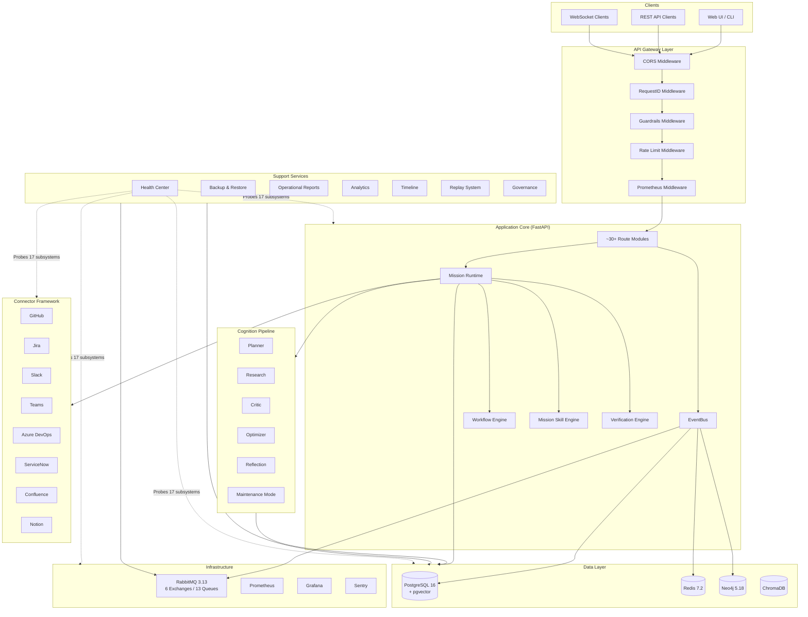

### Runtime Layers

| Layer | Store | Use Case |
|-------|-------|----------|
| In-Memory | `RuntimeState` (Python dict) | Hot path, sub-millisecond access |
| Cache | `RuntimeStateStore` (Redis 7.2) | Session tracking, token blacklist, cognition cache, replay hot store |
| Persisted | Neo4j 5.18 | Cognitive graph: agents, memories, concepts, world models |

### Technology Stack

| Component | Technology | Purpose |
|-----------|-----------|---------|
| Backend | FastAPI + async Python 3.13 | HTTP/WebSocket server |
| Async Runtime | asyncio | Coroutine orchestration |
| Database | PostgreSQL 16 + pgvector | Primary store with vector embeddings |
| Cache | Redis 7.2 | Session, tokens, cache, hot replay |
| Message Broker | RabbitMQ 3.13 | Async orchestration, agent messaging |
| Graph Engine | Neo4j 5.18 | Cognitive graph |
| Vector Store | ChromaDB | Local vector fallback |
| Metrics | Prometheus + Grafana | Observability |
| Errors | Sentry | Error tracking |

---

## 2. Mission Runtime

The `MissionRuntimeService.execute_mission()` is the main entry point for all mission execution.

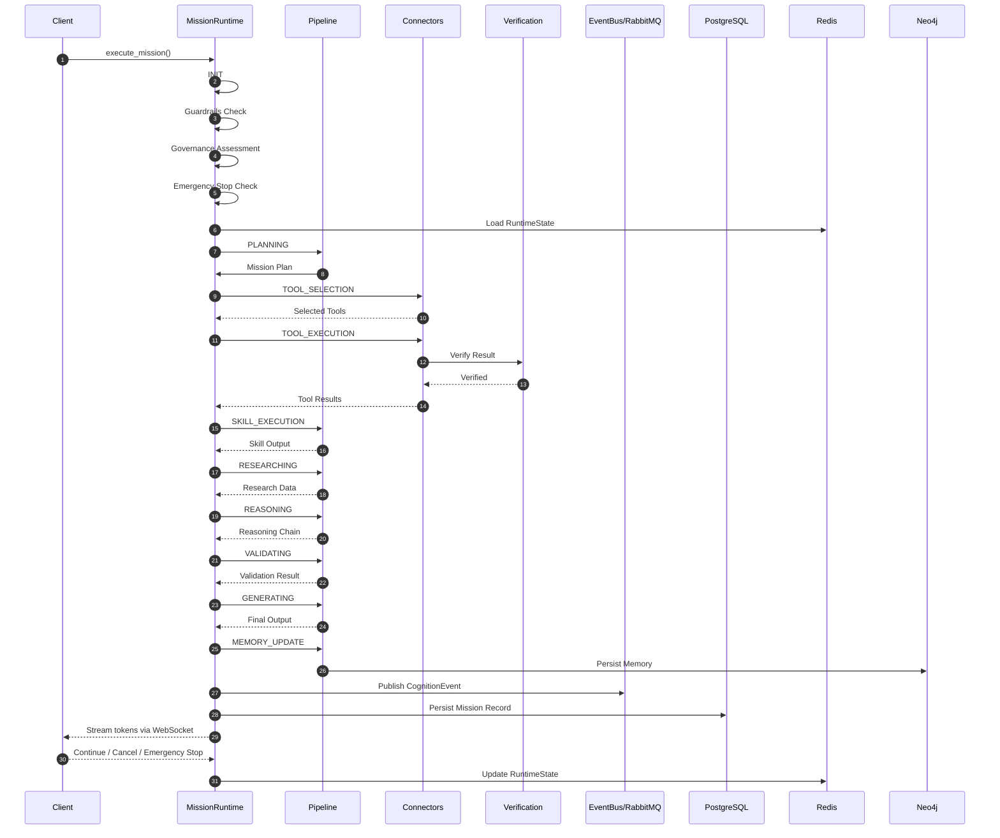

### Pipeline Stages

| Stage | Description |
|-------|-------------|
| INIT | Initialize runtime state, validate inputs |
| PLANNING | Decompose mission into steps |
| TOOL_SELECTION | Select appropriate connectors/tools |
| TOOL_EXECUTION | Execute connectors with retry + verification |
| SKILL_EXECUTION | Execute mission skills |
| RESEARCHING | Gather relevant context and data |
| REASONING | LLM-driven reasoning chain |
| VALIDATING | Verify outputs against criteria |
| GENERATING | Generate final response |
| MEMORY_UPDATE | Persist to cognitive graph |
| COMPLETED | Finalize and emit events |

### Key Features

- LLM token streaming via WebSocket
- Connector execution with exponential backoff retry (1s-30s with jitter)
- Post-execution verification with read-back
- Emergency stop (global + per-execution)
- Guardrails checks on all input/output

---

## 3. Workflow Engine

Manages approval gates, emergency stops, and workflow orchestration.

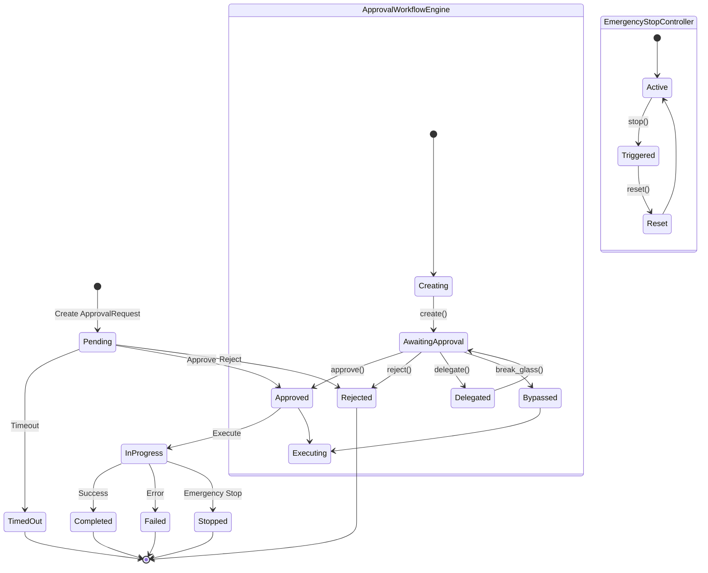

### Components

| Component | Description |
|-----------|-------------|
| `ApprovalQueue` | asyncio.Event-based approval gates |
| `ApprovalRequest` | Lifecycle: pending → approved/rejected/timed_out |
| `EmergencyStopController` | Global + per-execution + per-agent stop |
| `ApprovalWorkflowEngine` | Create, approve, reject, delegate, break-glass |

---

## 4. Mission Skill Engine

Executes modular skills within the mission pipeline. Skills are registered components that encapsulate specific capabilities (code execution, data transformation, LLM prompts, etc.).

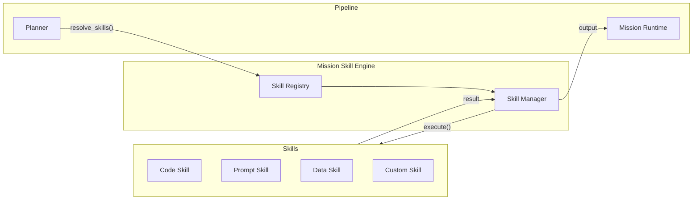

### Skill Lifecycle

1. **Registration** — Skills register with the Skill Registry at startup
2. **Resolution** — Planner resolves required skills from mission plan
3. **Execution** — Skill Manager executes each skill with context
4. **Verification** — Results pass through Verification Engine
5. **Completion** — Output merged into mission state

---

## 5. Verification Engine

Post-execution verification service that performs read-back validation on connector/ skill outputs.

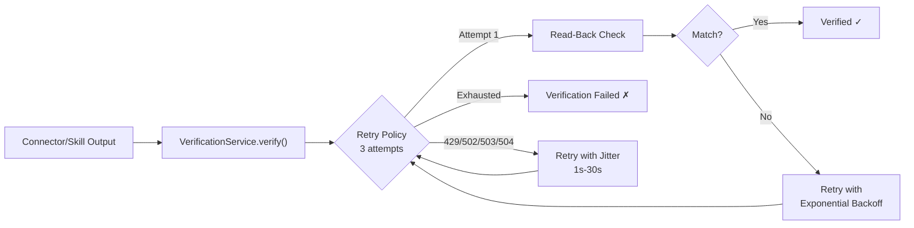

### Configuration

| Parameter | Value |
|-----------|-------|
| Max Retries | 3 |
| Backoff Range | 1s – 30s |
| Jitter | Enabled (randomized) |
| RETRYABLE_STATUSES | 429, 502, 503, 504 |

---

## 6. Connector Framework

Eight enterprise connectors with a common abstract base.

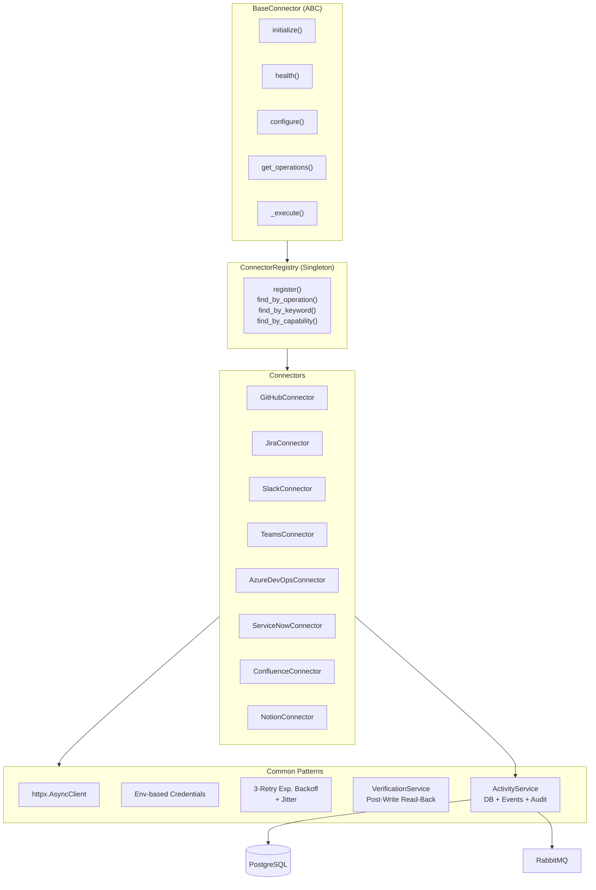

### Connector Matrix

| Connector | Auth | Key Operations |
|-----------|------|----------------|
| GitHub | Token | repos, issues, PRs, commits, actions |
| Jira | Token/Basic | issues, projects, sprints, boards |
| Slack | Bot Token | messages, channels, users, files |
| Teams | OAuth | messages, teams, channels, members |
| Azure DevOps | PAT | repos, pipelines, work items, builds |
| ServiceNow | Basic | incidents, changes, requests, cmdb |
| Confluence | Token | pages, spaces, attachments, search |
| Notion | Integration Token | pages, databases, blocks, users |

### Activity Recording

Each connector execution triggers `ActivityService` which:
1. Records activity to PostgreSQL
2. Publishes events to EventBus/RabbitMQ
3. Writes audit log entries

---

## 7. Replay System

Dual-layer persistence for mission event replay with 26 canonical event types.

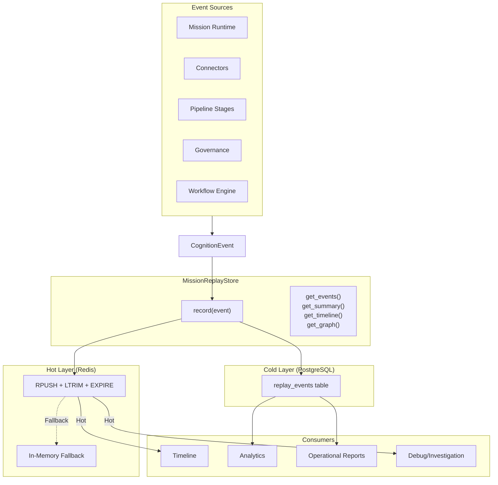

### Event Lifecycle

| Phase | Location | Duration |
|-------|----------|----------|
| Record | Redis RPUSH | ~1ms |
| Hot Retention | Redis (LTRIM + EXPIRE) | Configurable TTL |
| Cold Persistence | PostgreSQL | Indefinite |
| Fallback | In-memory list | Until service restart |

### 26 Canonical Event Types

Mapped from `CognitionEvent` — includes mission lifecycle events, connector calls, pipeline stage transitions, governance decisions, approval actions, errors, and system events.

---

## 8. Timeline

Temporal view of mission execution with event ordering and causal relationships.

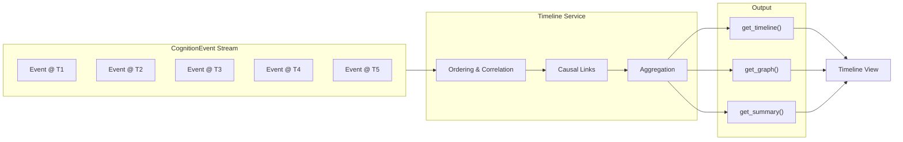

### Features
- Event ordering with causal links
- Correlation across concurrent missions
- Aggregation into summary views
- Graph-based visualization support

---

## 9. Analytics

Metrics, aggregations, and insights derived from mission execution data.

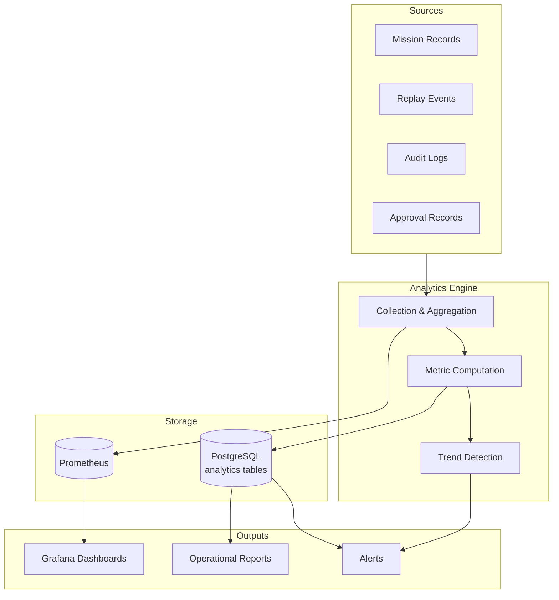

### Tracked Metrics
- Mission counts (total, by status, by type)
- Success/failure rates
- Connector utilization
- Workflow utilization
- Approval statistics (avg approval time, rejection rate, break-glass frequency)
- Cost metrics (LLM token usage, compute time)

---

## 10. Governance

Multi-layered security and compliance system.

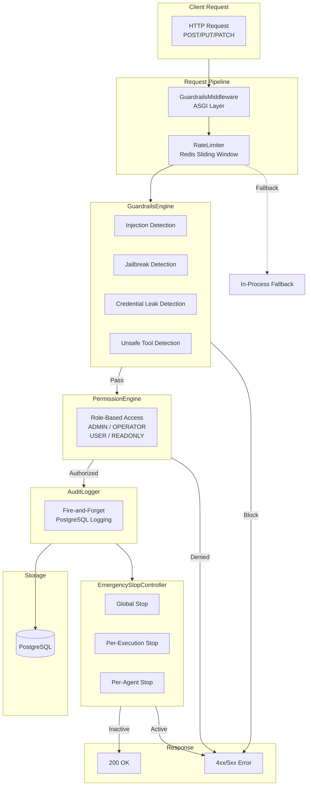

### Governance Components

| Component | Mechanism | Scope |
|-----------|-----------|-------|
| GuardrailsMiddleware | ASGI middleware | All POST/PUT/PATCH requests |
| GuardrailsEngine | Regex-based checks | Injection, jailbreak, credential leak, unsafe tools |
| RateLimiter | Redis sliding-window + in-process fallback | Per-client rate limiting |
| PermissionEngine | Role-based (RBAC) | ADMIN/OPERATOR/USER/READONLY |
| AuditLogger | Fire-and-forget to PostgreSQL | All mission and governance events |
| EmergencyStopController | Global + per-execution + per-agent | Immediate mission halt |

---

## 11. Health Center

> **Retired in Phase 10.29 (ADR-119).** The Health Center API/model surface was removed from the repository. Discovery (Phases 10.23, 10.27, 10.28) found no production consumer, no frontend client, no operator workflow and no table on any database; the routes had been mounted at `/api/api/…` since their introduction and answered `UndefinedTableError` on every migration-built database. The historical description is preserved in git history and in `docs/PHASE_10_27_GA_SURFACE_DECISION_DISCOVERY.md`.

## 12. Backup & Restore

> **Retired in Phase 10.29 (ADR-119).** The file-based Backup & Restore API/model surface was removed from the repository. Discovery (Phases 10.23, 10.27, 10.28) found no production consumer, no frontend client, no operator workflow and no table on any database; the routes had been mounted at `/api/api/…` since their introduction and answered `UndefinedTableError` on every migration-built database. The historical description is preserved in git history and in `docs/PHASE_10_27_GA_SURFACE_DECISION_DISCOVERY.md`.

GA backup/DR is `scripts/backup-database.sh` and the Helm `backup-cronjob.yaml` (`pg_dump`); they are unaffected and remain the documented mechanism (Administrator Guide §11, DR Runbook §2).

## 13. Maintenance Mode

> **Retired in Phase 10.29 (ADR-119).** The Maintenance Mode API/model surface was removed from the repository. Discovery (Phases 10.23, 10.27, 10.28) found no production consumer, no frontend client, no operator workflow and no table on any database; the routes had been mounted at `/api/api/…` since their introduction and answered `UndefinedTableError` on every migration-built database. The historical description is preserved in git history and in `docs/PHASE_10_27_GA_SURFACE_DECISION_DISCOVERY.md`.

The integration point this section previously documented — `should_block_new_mission()` "called by Mission Runtime before starting missions" — was never implemented; no caller existed in any commit (Phase 10.28). Mission admission is unchanged by the retirement.

## 14. Operational Reports

> **Retired in Phase 10.29 (ADR-119).** The Operational Reports API/model surface was removed from the repository. Discovery (Phases 10.23, 10.27, 10.28) found no production consumer, no frontend client, no operator workflow and no table on any database; the routes had been mounted at `/api/api/…` since their introduction and answered `UndefinedTableError` on every migration-built database. The historical description is preserved in git history and in `docs/PHASE_10_27_GA_SURFACE_DECISION_DISCOVERY.md`.

The report schedule this section previously documented had no scheduler behind it.

## Infrastructure Topology

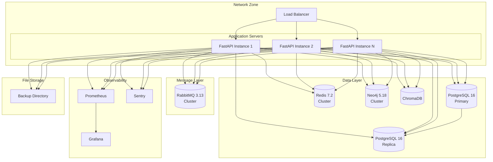

---

## Deployment Topology

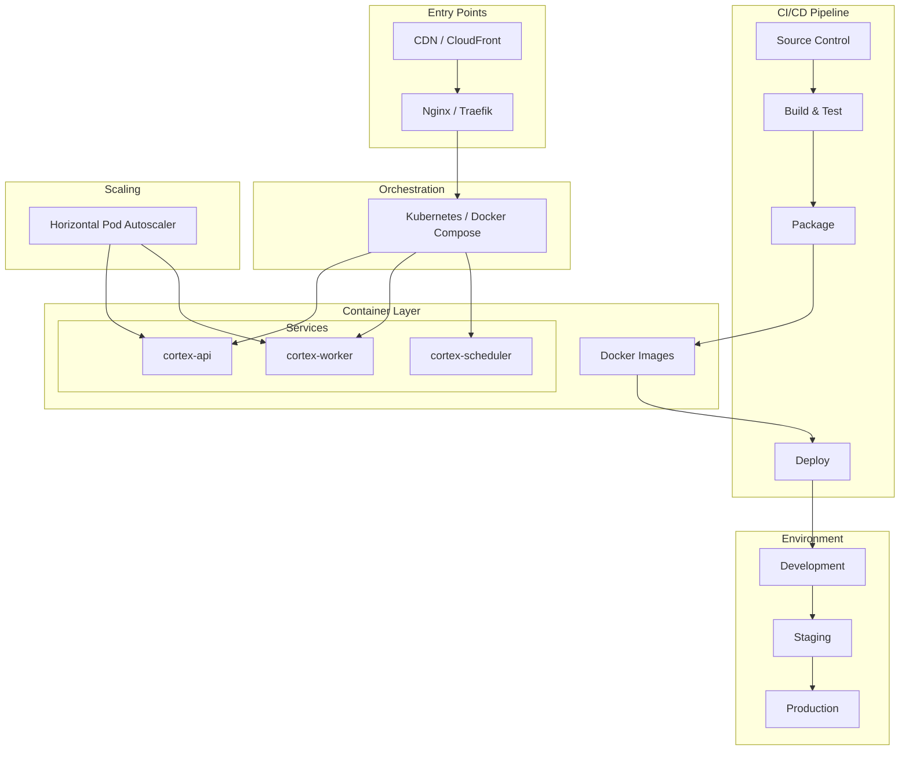

---

## Event Flow — CognitionEvent Lifecycle

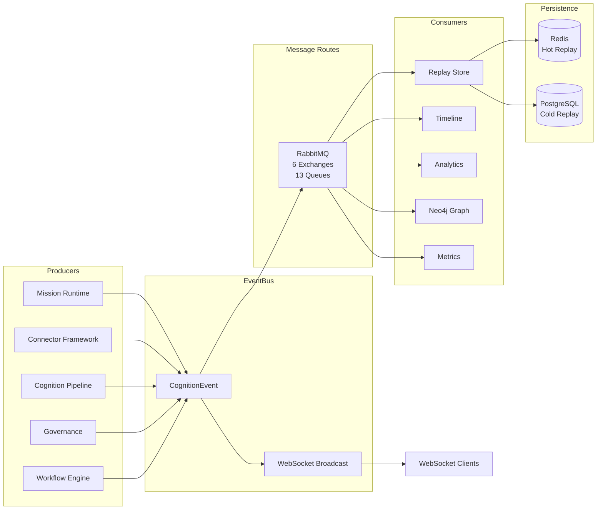

### 26 Canonical Event Types

| Category | Event Types |
|----------|-------------|
| Mission | mission.created, mission.started, mission.completed, mission.failed, mission.cancelled |
| Pipeline | pipeline.stage_started, pipeline.stage_completed, pipeline.stage_failed |
| Connector | connector.invoked, connector.success, connector.failed, connector.retry |
| Governance | guardrails.blocked, guardrails.warning, rate_limit.exceeded, auth.denied |
| Workflow | approval.created, approval.approved, approval.rejected, approval.timed_out, approval.break_glass |
| Emergency | emergency.stop_global, emergency.stop_execution, emergency.stop_agent |
| System | system.startup, system.shutdown, health.status_change, error.unhandled |

---

## Singleton Pattern

All services follow the module-level singleton pattern:

```python
# Every service module follows this pattern
_service = None

def get_service():
    global _service
    if _service is None:
        _service = ServiceClass()
    return _service
```

Services using this pattern: `MissionRuntimeService`, `ConnectorRegistry`, `GuardrailsEngine`, `RateLimiter`, `PermissionEngine`, `EmergencyStopController`, `HealthCenterService`, `MaintenanceManager`, `MissionReplayStore`.

---

## Graceful Degradation

All ~30+ route modules implement graceful degradation fallbacks. If a dependency (Redis, Neo4j, RabbitMQ) is unavailable, the system:
1. Falls back to in-memory alternatives where possible
2. Returns degraded response with warning header via `X-Degraded: <component>`
3. Logs degradation to Sentry and audit log
4. Continues serving remaining functionality
