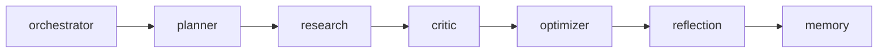
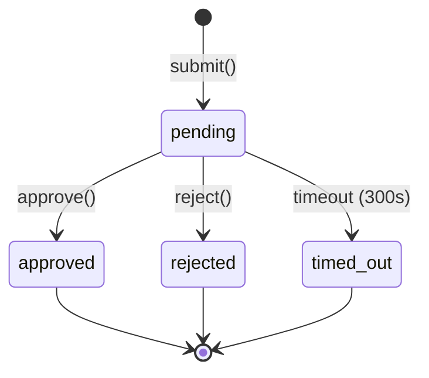
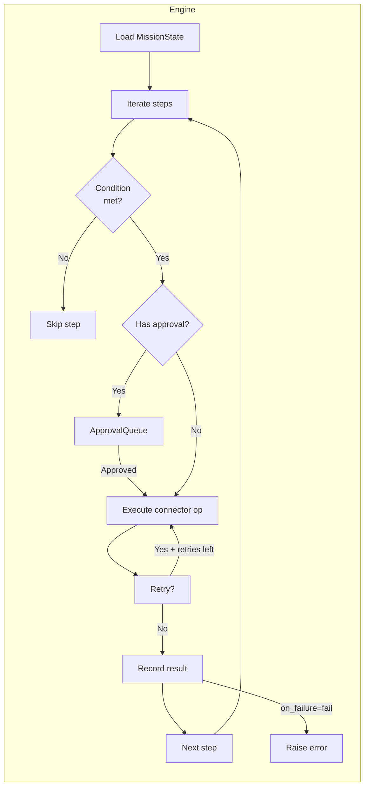
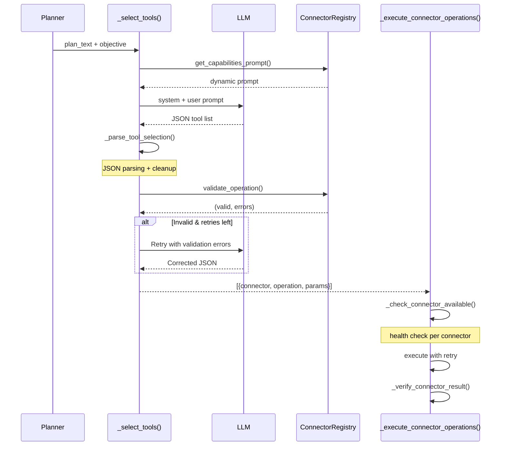

# CortexPrime Workflow Documentation

## 1. Workflow Definitions

Missions are structured as staged pipelines driven by `MissionRuntimeService.execute_mission()` in `backend/services/mission_runtime.py`.


### Pipeline Stages

| Stage | Constant | Description |
|---|---|---|
| INIT | `MissionStage.INIT` | Guardrails input check, governance risk assessment, Redis + Neo4j registration, emergency stop check |
| PLANNING | `MissionStage.PLANNING` | LLM decomposes the objective into an execution plan with memory context, browser/computer agent results, and workspace RAG injection |
| TOOL_SELECTION | `MissionStage.TOOL_SELECTION` | LLM selects enterprise connectors/workers from the ConnectorRegistry capabilities prompt; validates against registered operations |
| TOOL_EXECUTION | `MissionStage.TOOL_EXECUTION` | Executes selected connector operations with health checks, retry, verification, audit logging, and Neo4j recording |
| SKILL_EXECUTION | `MissionStage.SKILL_EXECUTION` | Runs enterprise workflow skills (e.g., SoftwareReleaseSkill) via the MissionSkillEngine |
| RESEARCHING | `MissionStage.RESEARCHING` | LLM synthesizes all context (plan, browser data, tool results, skill output, memory, workspace docs) |
| REASONING | `MissionStage.VALIDATING` | LLM critic evaluates research quality and assigns a confidence score (0.0–1.0) |
| VALIDATING | `MissionStage.VALIDATING` | Confidence scoring and hallucination detection |
| GENERATING | `MissionStage.GENERATING` | Final response streamed token-by-token over WebSocket `stream_chunk` events |
| MEMORY_UPDATE | `MissionStage.MEMORY_UPDATE` | ChromaDB vector storage + full lifecycle via MemoryContextService (episodic, semantic, reflection) |
| COMPLETED | `MissionStage.COMPLETED` | Prometheus metrics, cost engine analytics, audit log, runtime state store finalization |

### ExecutionContext

The `ExecutionContext` dataclass (`backend/orchestration/execution_context.py`) carries all pipeline state:

| Field | Type | Purpose |
|---|---|---|
| `execution_id` | `str` | UUID v4 identity |
| `objective` | `str` | Mission goal |
| `current_stage` | `str` | Active pipeline stage |
| `completed_stages` | `List[str]` | Stages finished successfully |
| `failed_stages` | `List[str]` | Stages that errored |
| `stage_timings` | `Dict[str, float]` | Duration in ms per stage |
| `retry_count` | `int` | Current retry attempt |
| `max_retries` | `int` | Default `2` |
| `status` | `str` | `pending`, `running`, `completed`, `failed` |
| `errors` | `List[str]` | Accumulated error messages |

### CognitionPipeline

The 6-stage `CognitionPipeline` (`backend/orchestration/cognition_pipeline.py`) runs inside `MissionRuntimeService`:



| Stage | Agent Name | Input | Output |
|---|---|---|---|
| Planner | `planner` | `objective` | `ctx.plan` |
| Research | `research` | `objective`, `plan` | `ctx.research_result` |
| Critic | `critic` | `research_result`, `plan` | `ctx.critic_result` |
| Optimizer | `optimizer` | `research_result`, `critic_notes` | `ctx.optimizer_result` |
| Reflection | `reflection` | All prior outputs + timings | `ctx.reflection_result` |
| Memory | `memory` | Final content + trace | `ctx.memory_result` |

---

## 2. Templates

### Mission Library Templates

Mission workflows are expressed as declarative `WorkflowDefinition` objects. The `WorkflowDefinition` (`backend/mission_skills/models.py`) contains:

| Field | Type | Description |
|---|---|---|
| `skill_type` | `str` | Unique workflow identifier |
| `description` | `str` | Human-readable summary |
| `steps` | `List[WorkflowStepDef]` | Ordered step definitions |

### WorkflowStepDef

| Field | Type | Description |
|---|---|---|
| `id` | `str` | Unique step identifier |
| `name` | `str` | Human-readable name |
| `connector` | `Optional[str]` | Connector type (e.g. `"github"`) |
| `operation` | `str` | Method to call (e.g. `"create_branch"`) |
| `params` | `Dict[str, Any]` | Parameters with `$params.*` / `$steps.*` references |
| `retry` | `RetryPolicy` | Retry configuration |
| `approval` | `Optional[ApprovalConfig]` | Approval gate configuration |
| `outputs` | `Optional[Dict[str, str]]` | Field selectors from raw result |
| `timeout` | `Optional[float]` | Per-step timeout in seconds |
| `condition` | `Optional[str]` | Expression evaluated before execution |
| `on_failure` | `str` | `"fail"` (default), `"skip"`, or `"continue"` |

### Parameter Rendering

The engine resolves `$params.*` and `$steps.*` references recursively:

- `$params.owner` → `context["release_params"]["owner"]`
- `$steps.create_release_branch.branch` → `previous_results["create_release_branch"]["branch"]`

---

## 3. Approval Gates

### ApprovalQueue

The `ApprovalQueue` (`backend/safety/approval_queue.py`) is an in-memory queue with `asyncio.Event`-based blocking.



### ApprovalRequest Dataclass

| Field | Type | Description |
|---|---|---|
| `request_id` | `str` | UUID |
| `execution_id` | `str` | Linked mission |
| `agent` | `str` | Requesting agent name |
| `action` | `str` | Action being approved |
| `description` | `str` | Human-readable justification |
| `risk_level` | `str` | `"low"`, `"medium"`, `"high"`, `"critical"` |
| `status` | `ApprovalStatus` | `pending` / `approved` / `rejected` / `timed_out` |
| `context` | `Dict[str, Any]` | Arbitrary metadata |

### Lifecycle

1. **`submit()`** (`backend/safety/approval_queue.py:104`): Creates request, publishes `approval_requested` event via `CognitionEvent` over WebSocket, blocks with `asyncio.wait_for(event.wait(), timeout=300)`
2. **`approve(request_id, approved_by)`** (`:164`): Sets `status=APPROVED`, calls `event.set()`, emits `approval_granted`
3. **`reject(request_id, rejected_by, reason)`** (`:192`): Sets `status=REJECTED`, calls `event.set()`, emits `approval_rejected`
4. **Timeout**: Default 300 seconds; auto-sets `TIMED_OUT` status, emits `approval_timed_out`

### Governance Event Payload

All state transitions publish a `CognitionEvent` with `agent="governance"` containing:

```json
{
  "event_type": "approval_granted",
  "governance_status": "approved",
  "payload": { "request_id": "...", "resolved_by": "operator" }
}
```

### Integration Points

- **Mission pipeline**: `_governance_request_approval()` at `backend/services/mission_runtime.py:96` gates mission start
- **Skill engine steps**: `MissionSkillEngine._execute_approval()` blocks per-step with configurable `ApprovalConfig`
- **Emergency stop**: `EmergencyStopController` auto-rejects all pending approvals on activation

---

## 4. Retry Policies

### Connector HTTP Retry (`_request()`)

All 8 enterprise connectors implement identical retry logic:

| Parameter | Value |
|---|---|
| `MAX_RETRIES` | 3 |
| `BASE_BACKOFF_S` | 1.0 |
| `MAX_BACKOFF_S` | 30.0 |
| `RETRYABLE_STATUSES` | `{429, 502, 503, 504}` |

**Backoff formula**: `min(BASE_BACKOFF_S * 2^attempt, MAX_BACKOFF_S)` with ±50% jitter implied by the HTTP response timing.

**Example backoff sequence** (attempts 0, 1, 2): 1s → 2s → 4s (capped at 30s, but 4 < 30)

### Verification Service Retry

`VerificationService.verify_operation()` (`backend/services/verification_service.py:156`):

| Parameter | Value |
|---|---|
| `VERIFY_RETRIES` | 2 (3 total attempts) |
| `VERIFY_BACKOFF_S` | 1.0 |
| `VERIFY_TIMEOUT_S` | 15.0 |

**Backoff**: `VERIFY_BACKOFF_S * 2^attempt` → 1s → 2s

### Pipeline Stage Retry

`ExecutionContext` (`backend/orchestration/execution_context.py:14`):

| Field | Default |
|---|---|
| `max_retries` | 2 |
| `retry_count` | Incremented per retry |

`should_retry()` (`:93`): returns `True` when `status == "failed"` and `retry_count < max_retries`.

### Tool Execution Retry

`_execute_connector_operations()` (`backend/services/mission_runtime.py:899`):

- **Max retries**: 2 (3 attempts)
- **Backoff**: `1.0 * 2^attempt` → 1s, 2s, 4s
- Applied per individual connector operation

### MissionSkillEngine Step Retry

Configurable per-step `RetryPolicy`:

| Strategy | Behavior |
|---|---|
| `"none"` | No retry |
| `"fixed"` | `base_delay_s` between attempts |
| `"exponential"` | `base_delay_s * 2^attempt` |

Default `RetryPolicy`: `max_retries=2`, `backoff_strategy="fixed"`, `base_delay_s=1.0`

### LLM Router Circuit Breaker

`ProviderStats` (`backend/llm/llm_router.py:130`):

| Parameter | Value |
|---|---|
| `CIRCUIT_FAIL_THRESHOLD` | 3 consecutive failures |
| `CIRCUIT_OPEN_SECS` | 60 seconds |

When a provider exceeds the threshold, it is skipped for 60 seconds. The router automatically falls back through the priority chain (e.g., Azure → OpenAI → Claude → Gemini).

---

## 5. Resume Behavior

### RuntimeStateStore

The canonical store (`backend/runtime/runtime_state_store.py`) uses Redis as the single source of truth:

```mermaid
flowchart LR
    subgraph Redis
        active[ZSET cx:rt:active]
        exec_[HASH cx:rt:exec:{eid}]
        history[ZSET cx:rt:history]
        hist_[HASH cx:rt:hist:{eid}]
        recovered[STRING cx:rt:recovered]
    end

    app[App Instance] -->|write-through cache| active
    app --> exec_
    app -->|startup: recover_on_startup| active
```

### Redis Key Schema

| Key Pattern | Type | TTL | Purpose |
|---|---|---|---|
| `cx:rt:exec:{execution_id}` | HASH | 24h | Active execution record |
| `cx:rt:active` | ZSET | — | Active member set (score = epoch) |
| `cx:rt:hist:{execution_id}` | HASH | 7d | Completed history record |
| `cx:rt:history` | ZSET | — | History index (score = epoch) |
| `cx:rt:recovered` | STRING | 7d | Cumulative recovery counter |

### Startup Recovery

`recover_on_startup()` (`backend/runtime/runtime_state_store.py:408`):

1. Scans `cx:rt:active` ZSET for all members
2. Loads each `cx:rt:exec:{eid}` HASH record
3. Marks loaded executions as `status = "recovered"`, `current_step = "recovered_after_restart"`
4. Persists updated status back to Redis
5. Increments `cx:rt:recovered` counter
6. Fires audit log event

### ExecutionContextManager

`ExecutionContextManager` (`backend/orchestration/execution_context.py:124`) provides a write-through cache pattern:

| Method | Behavior |
|---|---|
| `create()` | Creates context, saves to local dict + Redis pipeline context + `runtime_state_store` |
| `save()` | Write-through: local dict → `redis_cache.set_pipeline_context()` → `runtime_state_store.update/complete` |
| `get()` | Cache-first, then Redis fallback via `redis_cache.get_pipeline_context()` |
| `list_active()` | Redis-backed via `runtime_state_store.list_active()`, in-memory fallback |

### Replay Store

`MissionReplayStore` (`backend/services/mission_replay_store.py`):

| Parameter | Default |
|---|---|
| `REPLAY_REDIS_TTL_HOURS` | 72h (configurable via env var) |
| `REPLAY_MAX_EVENTS_REDIS` | 2000 events |

Replay events (e.g., `tool_called`, `workflow_step_started`, `verification_completed`) are stored as a Redis list per execution ID.

### Orphan Detection

On each startup, `recover_on_startup()` detects executions left in `running` state from a previous instance. These are transitioned to `recovered` so operators can inspect or replay them.

---

## 6. Failure Handling

### EmergencyStopController

`EmergencyStopController` (`backend/safety/emergency_stop.py:29`) provides multi-level kill-switches:

| Method | Scope | Effect |
|---|---|---|
| `activate_global()` | System-wide | Stops browser agent, cancels all pending approvals, broadcasts `emergency_stop_activated` |
| `stop_mission(execution_id)` | Single mission | Marks execution as stopped, closes browser session, rejects its pending approvals |
| `stop_browser_agent()` | Browser only | Closes all browser sessions |
| `stop_computer_agent()` | Computer only | Cancels all computer agent missions |

**Usage in pipeline**: `_is_emergency_stopped(execution_id)` is checked:
- After governance assessment in `execute_mission()` (`:1586`)
- Mid-pipeline after browser/computer agent execution (`:1842`)

### Graceful Degradation

All subsystems degrade gracefully when their dependencies are unavailable:

| Subsystem | Fallback |
|---|---|
| Redis (runtime state) | In-memory dict cache, `_available` flag |
| Redis (general) | Silent pass — operations logged at DEBUG |
| Neo4j graph | Silent pass — operations logged at WARNING |
| Guardrails engine | Returns `None` (no blocking) on error |
| Memory retrieval | Proceeds without context |
| Workspace RAG | Skips document injection |
| Browser agent | Logs warning, continues pipeline |
| Computer agent | Logs warning, continues pipeline |
| LLM provider | Router falls back through provider chain |

### GuardrailsMiddleware

`GuardrailsMiddleware` (`backend/safety/guardrails_middleware.py:83`) intercepts all `POST`/`PUT`/`PATCH` requests:

| Decision | HTTP Status | Behavior |
|---|---|---|
| `BLOCK` | 400 | Returns structured JSON with `violation_type`, `rule`, `reason`, `risk_score` |
| `WARN` | 200 (pass-through) | Sanitizes the body text before reaching the route handler |
| `ALLOW` | 200 (pass-through) | No modification |

Fields scanned: `query`, `objective`, `message`, `prompt`, `content`, `task`, `description`, `text`, `input`, `instruction`, `action`, `command`, `goal`, `user_message`, `user_input`.

### Exception Handlers

`register_exception_handlers()` (`backend/core/exception_handlers.py:67`):

| Exception | Status | Response |
|---|---|---|
| `CortexError` | Per exception | `{code, message, request_id}` |
| `RequestValidationError` | 422 | Sanitized field-level errors (no raw input values) |
| `HTTPException` | Per exception | Standard error envelope |
| `Exception` (catch-all) | 500 | Canned message — never exposes stack traces or secrets |

All handlers:
- Log internally at ERROR with full traceback
- Capture to Sentry with `request_id` correlation
- Never expose `str(exc)` to the client

---

## 7. Mission Skills

### MissionSkillEngine

`MissionSkillEngine` (`backend/mission_skills/engine.py:25`) is the generic workflow executor:



**Entry point**: `execute(definition, execution_id, context)` (`:46`)

**Steps**:
1. Load/create `MissionStateModel` (persisted, supports resume)
2. Skip already-completed steps (`state.is_last_step_completed()`)
3. Evaluate step condition (renders `$params.*` / `$steps.*`)
4. Execute approval gate if `step_def.approval` is configured
5. Invoke connector operation with retry + timeout
6. Record result, persist state

**Return**: `_build_summary()` dict with `status`, `completed_steps`, `failed_steps`, `resources_created`, `approval_state`, per-step results.

### SoftwareReleaseSkill

`SoftwareReleaseSkill` (`backend/mission_skills/software_release.py:16`) extends `BaseMissionSkill`:

| Step | Operation | Connector | Approval |
|---|---|---|---|
| `create_release_branch` | `create_branch` | github | No |
| `create_pull_request` | `create_pull_request` | github | No |
| `wait_for_approval` | `__approval__` | None | Yes (configurable, 300s timeout, medium risk) |
| `merge_pull_request` | `merge_pull_request` | github | No |
| `create_github_release` | `create_release` | github | No |
| `dispatch_release_workflow` | `dispatch_workflow` | github | No |

**Detection**: `_is_release_workflow(objective)` (`backend/services/mission_runtime.py:235`) matches keywords: `"release version"`, `"cut a release"`, `"tag release"`, etc.

**Parameter extraction from objective**:
- Version: regex `v?(\d+\.\d+\.\d+)`
- Owner: regex `(?:owner|org|organization)[:\s]+(\S+)`
- Repo: regex `(?:repo|repository)[:\s]+(\S+)`

### Skill Execution in Pipeline

Skills run in the `SKILL_EXECUTION` stage (`backend/services/mission_runtime.py:2068`), after tool execution and before research. Results are injected into the researcher prompt as `skill_context_text`.

---

## 8. Dynamic Tool Selection

### Flow Overview



### _select_tools()

`_select_tools()` (`backend/services/mission_runtime.py:654`):

| Parameter | Purpose |
|---|---|
| `execution_id` | Correlation |
| `objective` | Mission goal |
| `plan_text` | Planner output (up to 2000 chars) |
| `deterministic` | When True, validates against registry with up to 2 retries |

**Prompt construction**: `_build_tool_selector_system_prompt()` (`:626`) calls `connector_registry.get_capabilities_prompt(include_examples=True)` for dynamic operation discovery.

### _parse_tool_selection()

`_parse_tool_selection()` (`backend/services/mission_runtime.py:723`):

1. Strips whitespace
2. Normalizes `True`/`False`/`None` → JSON booleans/null
3. Extracts first `[...]` bracket pair
4. Falls back to depth-based bracket parsing
5. Returns `[]` on failure

### _validate_tool_selection_with_capabilities()

`_validate_tool_selection_with_capabilities()` (`backend/services/mission_runtime.py:769`):

**Checks**:
1. Each item is a dict with `type`, `name`, `operation`, `params`
2. `type` is `"connector"` or `"worker"`
3. Workers are one of `{"browser", "computer"}`
4. Connectors must be registered in `ConnectorRegistry`
5. Operations must exist on the connector
6. Required parameters must be present

### _check_connector_available()

`_check_connector_available()` (`backend/services/mission_runtime.py:840`):

Calls `connector.health()` and requires `status == "available"`. Updates Prometheus `connector_health_checks` gauge. Returns `(available, reason)` tuple.

### _execute_connector_operations()

`_execute_connector_operations()` (`backend/services/mission_runtime.py:899`):

Per operation:
1. Resolve connector from `ConnectorRegistry`
2. Check method exists via `getattr()`
3. Health check via `_check_connector_available()`
4. Emit `tool_called` replay event
5. Execute with retry (max 2 retries, exponential backoff: 1s, 2s, 4s)
6. Emit `tool_completed` / `tool_failed` event
7. Run verification via `_verify_connector_result()`
8. Record Prometheus `tools_executed` and `tool_execution_duration` metrics

### ConnectorRegistry

`ConnectorRegistry` (`backend/connectors/registry.py:12`):

| Method | Purpose |
|---|---|
| `register(connector)` | Register a `BaseConnector` instance |
| `get(connector_type)` | Lookup by type string |
| `get_all_operations()` | Introspect all registered connectors |
| `get_capabilities_prompt()` | Build LLM prompt with operations, params, examples |
| `validate_operation()` | Check connector + operation + params validity |
| `health_all()` | Health check all connectors |

### Connector Set

8 enterprise connectors + 2 workers:

| Type | Connector | Operations |
|---|---|---|
| github | GitHubConnector | `create_branch`, `create_pull_request`, `merge_pull_request`, `create_release`, `dispatch_workflow`, etc. |
| jira | JiraConnector | Issue CRUD, project queries |
| slack | SlackConnector | Messages, channel operations |
| teams | TeamsConnector | Messages, team operations |
| azure_devops | AzureDevOpsConnector | Work items, pipelines |
| servicenow | ServiceNowConnector | Incident, change, ticket operations |
| confluence | ConfluenceConnector | Page operations |
| notion | NotionConnector | Database, page operations |
| worker | BrowserAgent | Live web browsing |
| worker | ComputerAgentV2 | Desktop automation |

### Tool Categories in LLM Prompt

```text
Available connectors and their operations:
- azure_devops:
  • create_work_item
    Description: Create a new work item
    Required: project, type, title
  ...

Available workers: browser, computer
```
